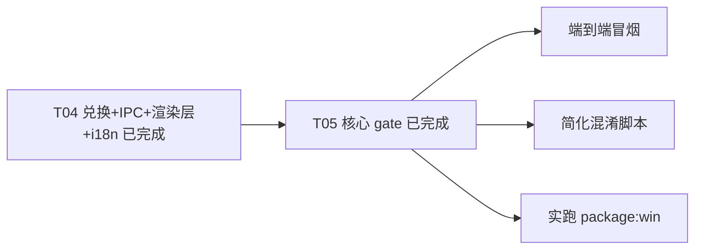

# plan-2.1 · 离线授权体系收尾结转（来源 plan-2.0 T05）

## 背景（承接说明，非归档）

`plan-2.0` 的 **T04（兑换 + IPC + 渲染层 + i18n）** 与 **T05 核心（feature-gate / 云同步 IPC 首行 gate / service 层兜底 gate / 云同步 UI 锁态 / 9 语种 i18n 校验）** 已全部完成，且已通过：

- `pnpm typecheck`（`tsconfig.main.json` + `tsconfig.json`）：exit 0，无错误；
- `_validate_locale.cjs`（9 语种）：`missingKeys=0` / `placeholderMismatch=0`；
- 删除陈旧的 `src/preload/index.d.ts`（与 `src/preload/index.ts` / `src/renderer/src/lib/electron.ts` 双源重复且大幅漂移，无任何代码 import，删除后 typecheck 仍 exit 0）。

本 plan **仅承接 plan-2.0 T05 中尚未落地的 3 项**，避免随 plan 删除而丢失。

## 范围与边界（已固化，不再展开）

离线授权体系主体已落地：`src/main/license/`（facade + 机器码 + vault + verifier + trial + feature-gate + redeem + config + keys + constants + types + errors + assets）、`src/shared/activation-types.ts`、`src/shared/license-constants.ts`、`src/main/activation-store.ts` 瘦身、`src/main/index.ts` 新 IPC 与 gate、`src/main/cloud-sync-service.ts` service 层兜底 gate、`src/renderer/.../{activationStore,ActivationModal,ActivationBadge,CloudSyncManager}`、`src/renderer/src/locales/*.json` 的 `license.*` 段。

## TODOS

> **本 plan 的 3 项未完成任务已于 2026-09-18 全量结转至 `doc/plan-2.3.md`「结转自 plan-2.1」段，本文件归档，不再持有待办。**

- 端到端冒烟 → 见 plan-2.3
- 简化 `scripts/obfuscate-main.mjs` → 见 plan-2.3
- 实跑 `pnpm run package:win` → 见 plan-2.3

## 任务依赖

