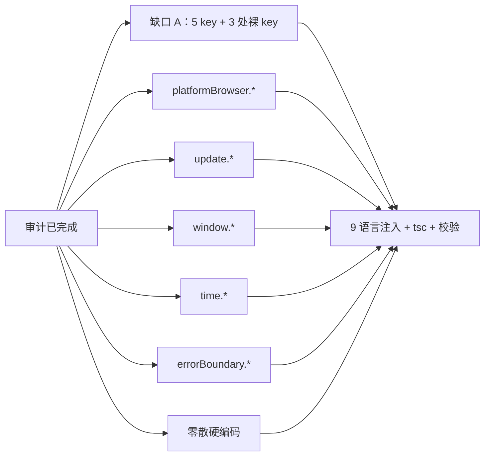

# plan-2.2 · i18n 文案层补全（来源：2026-09-18 i18n 全面审计）

> **状态：已完成（2026-09-18）** — T1–T8 全部落地，验证门禁通过。本文件保留作结转记录。

## 背景（已确认结论）

i18n **结构层已完善**：9 语言逐 key 完全对齐、0 死键、JSON 全部可解析。
但**文案层存在两类缺口**（用户已确认「全部修复 A+B」）：

- **缺口 A（5 个 key 被引用但 9 语言全缺）**：因 `i18n.ts` 未配 `parseMissingKeyHandler`/`returnEmptyString`，i18next 缺 key 时**返回 key 本身（truthy）**，故 `t('key') || '中文'` 兜底为死代码 → 界面显示裸 key 或中文默认值。
- **缺口 B（≈85 处硬编码中文绕过 `t()`）**：集中在 `PlatformConnectionBrowser`、`Settings`（在线更新区）、`Library`、`WindowControls`、`Inspector`、`SyncTasksPanel` 等。

## 范围与边界

- 仅**渲染层文案 i18n 化**：不改业务逻辑、不改任何查询传值（storeSource/分类/排序的 value 保持原始 id）。
- 新增 key 一律 **9 语言同步**（zh/en/ru/ja/de/it/es/fr/ar），遵循「9 语言全同步」惯例 + `fallbackLng:'en'` 兜底。
- 已存在的等价 key 优先复用（如 `installed.batchSyncHint`、`library.syncHint`、`library.mcpOverwriteHint`），不重复造键。

## 执行结果

### 交付概况

| 项 | 结果 |
| --- | --- |
| 9 语言 key 数 | **961 / 语言**，与 zh 逐 key 零偏差（缺 0 / 多 0） |
| 新增命名空间键 | ≈64 个（`platformBrowser.*` 22、`update.*` 11、`window.*` 4、`time.*` 3、`errorBoundary.*` 2、其余 22） |
| 代码替换点 | **≈76 处**（codemod 逐处匹配校验，0 MISS） |
| `tsc -p tsconfig.json --noEmit` | **exit 0** |
| CRLF 行尾 | 9 语言全部完整保持（1034 行，0 裸 LF） |
| 剩余硬编码中文 | 9 行，**全部为非缺口**（见下） |

### T1–T8 落地明细

- **T1 缺口 A**：注入 `addServer.cwd` / `store.requiresApiKey` / `store.categoryLabel` / `library.skillDiverged` / `skill.installUnavailable`；修正 3 处裸 key 渲染（`AddServerModal`、`SkillCard`、`Library` 的失效 `||` 兜底）。
- **T2 `platformBrowser.*`**：22 键，覆盖 toast / 直连来源·关键词标签 / SPA 提示 / 调用链路面板 / `第 N 页 · N 条` / 分页 aria-label。
- **T3 `update.*`**：11 键，`Settings` 在线更新区（检查中/检查更新/下载并安装/正在下载/已就绪/立即重启/已是最新/无法自动更新/手动下载）。
- **T4 `window.*`**：4 键，`WindowControls` 的最小化/最大化/还原/关闭 title+aria-label。
- **T5 `time.*`**：3 键，`SyncTasksPanel.formatTime` 增加 `t` 参数，刚刚 / {{count}} 分钟前 / {{count}} 小时前。
- **T6 `errorBoundary.*`**：2 键，`ErrorBoundary` 改走 `i18n.t()`（类组件无法用 hook）。
- **T7 零散硬编码**：`Library` 16 处、`SkillDetail` 5 处、`useCloudUpload` 5 处、`CreateSkillModal` 2 处、`ConnectionManager` 2 处、`CloudSyncManager` 1 处、`PlatformServerDetail` 1 处、`Inspector` 2 处。
- **T8 验证**：注入脚本 + codemod + 三段校验（key 并集对齐 / 源码 `t()`·`tk()` 交叉引用 / 硬编码中文复扫）全部通过。

### 附带发现与修复

1. **`library.uploadFailed` 被误覆盖（已恢复）**：注入脚本把原有键「解析失败」覆盖为「上传失败」。已从 `git show HEAD:` 取回 9 语言原值复原，并新增独立键 `library.cloudUploadFailed`（=「上传失败」）区分。
2. **fr 术语错误（本次新增修复）**：法语 `télécharger` 严格指「下载」，却被用于「上传」语义，且与同文件既有的 `Envoi/envoyer vers le cloud` 主流译法冲突。修正 3 处：
   - `library.uploadedToCloud`：`Téléchargé dans le cloud` → `Envoyé vers le cloud`
   - `library.uploadCloudFailed`：`Échec du téléchargement dans le cloud` → `Échec de l'envoi vers le cloud`
   - `library.cloudUploadFailed`：`Échec du téléchargement` → `Échec de l'envoi`
   其余 8 语言该组键经核对全部正确自洽，无需改动。

### 保留未动的 9 行硬编码中文（非缺口）

| 位置 | 原因 |
| --- | --- |
| `i18n.ts` 语言标签（简体中文/日本語…） | 语言选择器按惯例以本语言书写，设计如此 |
| `lib/electron.ts` ×5 | `console.warn` / `throw` / 浏览器预览 mock，开发者信息非 UI |
| `Library.tsx` 的 `'Electron API 不可用'` | error 对象文本，非渲染文案 |
| `ConsistencyBanner.tsx` 的 `\|\| \`云端与本地有 N 项不一致\`` | `consistency.bannerTitle` 未注入，属既有无害死兜底；未纳入本次范围 |

## 任务依赖（已完成）

