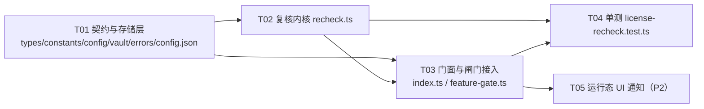

# ai-tools「定期联网复核授权状态」设计方案与任务分解

> 作者：架构师（高见远） · 面向：软件工程师实现
> 范围：仅客户端 `src/main/license/`，**本轮不改服务端**
> 口径：先核实事实再设计；未核实的一律标「未确认」，不下结论

---

## 0. 核实结论（先读这一节，后面的设计全部基于这些事实）

### 0.1 服务端 `billing-license-service` 复核端点：**存在，但与主理人的推测不同**

| 项 | 核实结果 | 证据 |
| --- | --- | --- |
| 端点 | `GET /api/licenses/verify/{licenseKey}`（**GET + 路径参数，不是 POST**） | `controller/LicenseController.java:58` |
| 鉴权 | **公开，无需登录** | `security/SecurityConfig.java:81` 已 `permitAll("/api/licenses/verify/**")` |
| 限流 | **60 次/分钟/IP**（`namespace=license-verify`）；超限返回 **429 且 body 为空** | `service/risk/RateLimitService.java:37-39,155-157`；`LicenseController.java:66` `ResponseEntity.status(429).<LicenseResponse>build()` |
| 成功响应 | 200，统一壳：`{success:true, code:"SUCCESS", data:{...}, traceId, timestamp}`；`data` 为 `LicenseResponse`：`id / licenseKey / customerEmail(=null) / productSku / status / issuedAt / expiresAt / lastVerifiedAt / machineCode / reissuedFrom / signedToken`。成功时 `status` **恒为 ACTIVE** | `dto/LicenseResponse.java`、`dto/ApiResponse.java`、`LicenseService#verifyLicense:233-274` |
| 失败响应 | **400**，`{success:false, code:"...", message, traceId, timestamp}`。业务码三种：`LICENSE_NOT_FOUND`（key 不存在）、`LICENSE_INVALID`（status ≠ ACTIVE，**含 REVOKED / REISSUED / 库内 signedToken 验签失败**）、`LICENSE_EXPIRED`（`expiresAt` 已过，顺带把库里置 EXPIRED） | `exception/GlobalExceptionHandler.java:41-47` + `LicenseService#verifyLicense` |
| 是否写库 | **是**。`@Transactional`，成功路径 `license.setLastVerifiedAt(now); licenseRepository.save(license)` → **每次成功复核一次 UPDATE** | `LicenseService.java:267-270` |
| 失败是否写库 | **是**。三条失败分支都 `recordLicenseEvent(VERIFY_FAILED)` → 写 `license_events` 一行 | `LicenseService.java:242,253,262` |
| 能否区分四态 | **能区分「正常 / 明确无效 / 明确过期」，但**：① 「明确吊销」与「服务端库内签名校验失败」同为 `LICENSE_INVALID`，**不可区分**；② 「key 不存在」是 `LICENSE_NOT_FOUND`，**不能**当作吊销处理 | 同上 |
| 有无 `serverTime` | **没有**（`LicenseResponse` 无此字段，与 `ActivateResponse` 不同）。客户端要时间口径只能用 HTTP `Date` 响应头 | `dto/LicenseResponse.java` |

### 0.2 退款 / 订阅到期链路：**服务端已有权威状态，客户端只需「问」**

- 退款：`AdminService` 渠道退款成功后，把该订单下所有 License 置 `REVOKED` + 写事件（`AdminService.java:267-281`）→ 复核会拿到 `LICENSE_INVALID`。✅
- 订阅取消：`SubscriptionService#expireLicense` 置 `EXPIRED`（`SubscriptionService.java:153-163`）→ 复核会拿到 `LICENSE_INVALID`（status 非 ACTIVE）。✅
- 结论：**「退款成功 / 订阅到期后要马上不能用」在服务端侧已经成立**，缺的只是客户端不问。

### 0.3 客户端现状

- `LicenseVault` 现有字段（`types.ts:135`）：`signed_token / activated_at / mid_at_activation / mid_soft_at_activation / watermark / server_time_floor / binding_reported`。**没有**任何「上次复核时间」字段。
- `vault.ts#sanitizeLicense`（`vault.ts:161`）是**白名单式解析**：`readVault()` 只输出 sanitize 里列出的键。**新增字段必须同步加进 sanitize，否则写入后读不出来**（主理人的提醒已核实为真）。
- 复核所需的 licenseKey **不用新增获取方式**：`verifier.ts#extractLicenseKeyFromToken(token)` 已存在（不验签直解 payload 的 `lic`），而服务端签发时无条件 `payload.put("lic", licenseKey)`（`LicenseIssuer.java:54`）。直接复用。
- 防时钟回拨的工具链已齐：`effectiveNow()` / `licenseFloor()` / `maxFloor()` / `raiseLicenseWatermark()` / `raiseLicenseServerFloor()` / `readAnchorFloor()` / `raiseAnchorFloor()`。**全部复用，不新造**。
- 后台 fire-and-forget 定时器已有先例：`machine-code.ts#warmupMachineCode`（`setTimeout` + `timer.unref()`）。**照抄这个形态**。
- `constants.ts:132` 已存在 `BACKGROUND_RECHECK_DELAY_MS`（机器码后台复核用），命名相近但语义不同，新常量不要复用它。

---

## 1. 实现方案

### 1.1 总思路（一句话）

**用现成的 `GET /api/licenses/verify/{licenseKey}` 做「问一句」；服务端明确说「无效/过期」→ 立即停用；服务端答不上来（网络/5xx/429/畸形/未知码）→ 走离线宽限累加；宽限耗尽才停用。停用一律是「软失效 + 可自愈」。

### 1.2 状态机（4 个新 vault 字段 + 1 个纯函数判定）

新增字段（`LicenseVault`，全部可选 → **老 vault 无需迁移**）：

| 字段 | 类型 | 语义 |
| --- | --- | --- |
| `last_checked_at` | `number \| null` | 上次**发起**复核的时刻（不论成败），ms。单调只增 |
| `last_verified_ok_at` | `number \| null` | 上次服务端**明确回答 ACTIVE** 的时刻，ms（日志/自愈观测用） |
| `offline_grace_used_ms` | `number` | 已消耗的离线宽限，ms，默认 0 |
| `revoked_by_server` | `boolean \| null` | 服务端明确回答吊销/过期 → 本地停用标记 |

复核四态 `RecheckVerdict`：

```
'active'   → 200 且 data.status === 'ACTIVE'
'revoked'  → 400 且 code ∈ { LICENSE_INVALID, LICENSE_EXPIRED }   ← 唯一能立即停用的态
'unknown'  → 其它一切：网络失败/超时/5xx/429/JSON 畸形/非 200 非 400/LICENSE_NOT_FOUND/未知码
'skipped'  → 无本地 token / extractLicenseKeyFromToken 取不到 / cfg.recheck.enabled=false
```

状态迁移（每次 `runRecheck`）：

```
active  : used = 0 ; revoked_by_server = false ; last_verified_ok_at = now ; last_checked_at = now
revoked : revoked_by_server = true ; last_checked_at = now
unknown : elapsed = last_checked_at == null ? 0 : max(0, now - last_checked_at)
          used += min(elapsed, cfg.recheck.intervalMs)        // ← 见 1.3 的钳制
          last_checked_at = max(last_checked_at ?? 0, now)    // 单调，防回拨
          if (used >= offlineGraceDays * 86400_000) → 停用
skipped : 一切不动
```

**停用判定统一出口**（`getState` 与 `assertFeature` 共用，避免两处漂移）：

```ts
export function isDisabledByRecheck(license: LicenseVault | null, cfg: LicenseConfig): boolean {
    if (!license) return false;
    if (license.revoked_by_server === true) return true;
    const used = typeof license.offline_grace_used_ms === 'number' ? license.offline_grace_used_ms : 0;
    return used >= cfg.recheck.offlineGraceDays * 86_400_000;
}
```

### 1.3 关键取舍 ①：轮询定时器放哪

**放在 `src/main/license/recheck.ts`（新文件），由 `license/index.ts#init()` 启动。**

- 形态：**递归 `setTimeout`**（不是 `setInterval`）——因为不同 verdict 的下次间隔不同（24h / 限流退避 1h），递归更好表达；每个 timer 都 `unref()`，不阻止进程退出（与 `warmupMachineCode` 同口径）。
- 调度：`scheduleNext(delayMs)`
  - `active` / `revoked` → `intervalMs`（24h）
  - `unknown` 且 `httpStatus === 429` → `rateLimitedRetryMs`（1h）+ 随机 0~10min jitter
  - 其它 `unknown` → `intervalMs`（24h）
- 启动首次复核：`init()` 里 `void runRecheck()`，**不 await、不阻塞窗口**（`license.init()` 已在 `main/index.ts:237` 被 fire-and-forget 调用）。启动即查，不加 jitter（退款时效优先）；jitter 只用在 429 退避上。
- 进程内单例：模块级 `loopTimer`，`startRecheckLoop()` 重复调用先 `clearTimeout`。
- 纯逻辑 `runRecheck(nowMs = Date.now())` 独立导出 → 单测可直接调，不依赖定时器。

### 1.4 关键取舍 ②：宽限如何判定（**这里有一个需要用户拍板的分歧**）

| | 方案 A：自然日 | 方案 B：按真实使用时长钳制累加（**推荐**） |
| --- | --- | --- |
| 判定 | `now - last_verified_ok_at > 7天` | `offline_grace_used_ms >= 7天`，每次 unknown 时 `used += min(经过时长, 24h)` |
| 字段 | 1 个（`last_verified_ok_at`；老 vault 为 null 时必须**乐观初始化为 now**，否则老用户升级后一断网就被停） | 2 个（`last_checked_at` + `offline_grace_used_ms`；老 vault null → used 默认 0，天然安全） |
| 连续运行断网 | 7 天后停 ✅ | 7 天后停 ✅ |
| 每天开一次断网 | 7 天后停 ✅ | 7 天后停 ✅ |
| **出差 10 天不开机，回来当天离线打开** | ❌ **立即停用**（自然日已超 7 天）—— 正是川哥点名「不得被误伤」的场景 | ✅ 只消耗 1 天宽限（`min(10天, 24h)`），继续可用 |
| **系统睡眠/休眠唤醒导致的定时器漂移** | 需额外处理 | ✅ 自动成立：`elapsed` 被 `min(..., intervalMs)` 钳住，一次长间隔最多只消耗 1 个周期 |

> 最后一行由 software-engineer 补充，已并入本表；A 方案不具备这个性质。
| 攻击面 | 严格 | 略宽：断网者每 6 天才开一次软件，可用 ~42 自然日，但**实际使用时长仍只有几分钟**，收益极小 |
| 代码量 | 少 | 多约 8 行（`min` 钳制 + 单调更新） |

**我推荐 B**：它同时白送了两个安全性——① 老 vault 字段缺失时天然安全（不需要"乐观初始化"这种容易漏的补丁）；② 「长时间不用软件」不消耗宽限，正面回应「出差/飞机不误伤」。代价只有 8 行。
**不冲突说明**：24h 间隔与 7 天宽限**本身没有技术冲突**——7 天宽限只覆盖「服务端答不上来」，服务端明确答「吊销」是立即停，不受宽限影响。

### 1.5 关键取舍 ③：时钟回拨怎么防（全部复用既有实现）

1. 所有时间基准用 `effectiveNow(trial, now, maxFloor(licenseFloor(license), await readAnchorFloor()))`，**禁止裸 `Date.now()`**（与 `getState` / `assertFeature` 现有一致）。
2. `last_checked_at` 只增不减；`elapsed` 取 `max(0, ...)` → 回拨时宽限**不会倒退也不会暴涨**。
3. 复核成功时读 HTTP `Date` 响应头（GMT，无时区歧义）→ `raiseLicenseServerFloor(license, dateMs)` 抬高 `server_time_floor`（**已存在的函数，直接复用**）。拿不到就跳过，不影响主流程。
4. `revoked_by_server` 一旦置 true，**只有下次复核成功才能清 false**，本地改时间无法复活。
5. 停用后**继续 24h 轮询** → 若属误判，服务端恢复后自动自愈。

### 1.6 停用如何生效（「马上不能用」的两个闸门）

- **`getState()`**：停用判定**必须放在 `verifyToken()` 之前**（见下方「优先级」），命中则返回 `{...baseState(), machineCode, degraded: 'token_invalid'}`（即 `status:'inactive'`）。**不停用时不改动任何返回**。
- **`assertFeature()`**：在 `verifyToken` 成功后追加同一检查 → true 则 `{allowed:false, code:'LIC_RECHECK_REVOKED', payload:null}`。这是云同步等付费功能的真实闸门。
- **不清 vault、不删 token、不清 trial** → 用户重新联网复核成功即恢复（自愈），或重新激活。
- 对外文案：`degraded: 'token_invalid'`（该值已存在于 `ActivationDegradedReason`），复用既有引导 UI。**不新增、不回传任何服务端错误码**。

**⚠️ 优先级（易漏）：停用判定必须压过「硬件变更宽限」**

`getState()` 现有分支里，`LIC_MACHINE_MISMATCH` 会走 `resolveHardwareGrace()` 并返回 `status:'activated'`
（再给 7 天硬件宽限）。若把停用闸门只挂在「验签成功分支」，则出现真实绕过：
**退款用户换一块硬盘 → 旧 token 验签机器码不匹配 → 命中硬件宽限 → 又获得 7 天可用期。**

因此 `getState()` 的插入点固定为：

```ts
if (token) {
    const floor = maxFloor(licenseFloor(vault.license), await readAnchorFloor());
    // ① 先推进水印与锚（防回拨，不受停用影响）
    const raised = raiseLicenseWatermark(vault.license, now);
    if (raised) await writeVault({trial: vault.trial, license: raised});
    await raiseAnchorFloor(now);
    const license = raised ?? vault.license;
    // ② 再判停用：优先级高于验签/硬件宽限
    if (isDisabledByRecheck(license, cfg)) {
        payloadCache = null;                       // 见下「会话缓存」
        return {...baseState(), machineCode: pair.strong, degraded: 'token_invalid'};
    }
    // ③ 才走原有验签流程（含 LIC_MACHINE_MISMATCH → 硬件宽限）
    const outcome = await verifyToken(token, {nowMs: effectiveNow(vault.trial, now, floor)});
    ...
}
```

**会话内载荷缓存必须一并清**（`payloadCache`）：其唯一外部消费点是
`src/main/updater.ts:79 → evaluateUpdateEntitlement(currentPayload(), ...)`。

> ⚠️ **理由准确口径（2026-09-24 修正，由 software-engineer 指出原表述有误）**：
> `update-gate.ts:27` 是 `payload === null → **放行** 更新**。因此清空的实际效果是
> 「**放宽**更新、去掉陈旧 `update_until` / `max_major_version` 造成的误拦」，
> **不是**收紧更新权限。停用后用户在语义上等同未激活，而 `update-gate.ts:24` 的设计口径
> 本就是「买断 / 未激活 / 试用（payload 为 null）不受限」——放行更新是自洽的。
> 另：`assertFeature` 每次走 `verifyToken` **现算**（`feature-gate.ts:70`），不读 `payloadCache`，
> 故付费功能闸门不受此项影响，清空只作用于更新软门控。
>
> **产品决策（本轮拍板）**：接受「停用后放行更新」。若产品意图是「退款用户不得再拿到更新」，
> 清 `payloadCache` 是**错的工具**——需把停用状态传进 `evaluateUpdateEntitlement`（改签名或加参数），
> 属独立产品决策，**本轮不做**（见 §7 待明确 11）。

```ts
// feature-gate.ts 停用分支：payload 一律 null
return {allowed: false, code: 'LIC_RECHECK_REVOKED', payload: null};

// license/index.ts#assertFeature
if (result.code === 'LIC_RECHECK_REVOKED') payloadCache = null;
else if (result.payload) payloadCache = result.payload;
```

**去激活（`deactivate()`）的字段处置**：现有实现（`index.ts:406-409`）手写字面量只带 4 个键，
因此 `watermark` / `server_time_floor` / `binding_reported` 以及新增的 4 个复核字段都会被**丢弃**（即重置）。
对复核字段而言这正是期望语义（去激活＝清干净复核状态），**但依赖「漏写」来实现重置太脆弱**。
T01 请改为显式写法，**其余字段的既有行为保持不变**（尤其不要顺手把 `watermark` 保留下来——
那是既有行为变更，需单独评估，本轮不动）：

```ts
license: {
    ...vault.license,
    signed_token: null, activated_at: null,
    mid_at_activation: null, mid_soft_at_activation: null,
    revoked_by_server: false, offline_grace_used_ms: 0,
    last_checked_at: null, last_verified_ok_at: null,
    watermark: null, server_time_floor: null, binding_reported: null,  // 显式保持「丢弃」现状
}
```

### 1.7 误判停用是资损级事故 —— 七道「宁可放过也不误杀」

1. **白名单码**：只有 `LICENSE_INVALID` / `LICENSE_EXPIRED` 两个码能立即停用。`LICENSE_NOT_FOUND`（key 不存在 —— 可能是服务端数据迁移/恢复）、`429`、`5xx`、网络失败、超时、JSON 畸形、非 200/400 状态码 → **一律 unknown 走宽限**。
2. **429 必须照常累加宽限**（**不可**因「服务端在限流」就免扣）：否则攻击者只要对自身出口 IP 打满 verify 限流（60/min），客户端就永远只能拿到 429 → **永不停用，限流直接变成永久续命后门**。429 累加宽限后，攻击者撑死也就 7 天（且要 7×24h 持续打满限流）。429 的下次调度仍走 `rateLimitedRetryMs`（1h + jitter）。
3. **不设「二次确认」**（原 `doubleConfirm` 已**取消**）：它防不住想防的东西——服务端系统性错误或代理缓存的错误响应，第二次请求会命中同样的结果；反而引入「第一次明确吊销 + 第二次 429」这类定义不清的中间态，以及上述限流后门。防误杀靠本条目的其余五道。
4. **异常绝不上抛**：`runRecheck` 全流程 `try/catch`，任何异常 → `unknown`，绝不影响主进程。
5. **软失效**：只置标记，不销毁任何数据。
6. **持续自愈**：停用后仍按 `intervalMs` 轮询，服务端恢复即复活。
7. **秒级回滚开关**：`license.config.json` 的 `recheck.enabled=false` → `getState` / `assertFeature` **完全忽略停用标记**，已停用用户重启即恢复。这是资损事故的第一处置手段（改包外配置，不需发版）。

---

## 2. 文件清单（按依赖与实现顺序）

| # | 路径 | 改动 | 说明 |
| --- | --- | --- | --- |
| 1 | `src/main/license/types.ts` | 改 | `LicenseConfig` 新增 `recheck: RecheckConfig`；`LicenseVault` 新增 4 个可选字段（含注释说明老 vault 无需迁移） |
| 2 | `src/main/license/constants.ts` | 改 | 新增 `LICENSE_VERIFY_API_PATH(licenseKey)`、`DEFAULT_RECHECK_*` 一组常量 |
| 3 | `src/main/license/config.ts` | 改 | `cloneDefault()` + `mergeConfig()` 解析 `recheck` 段（字段级兜底、非法值回落默认，与既有风格一致） |
| 4 | `src/main/license/vault.ts` | 改 | **`sanitizeLicense()` 白名单里登记 4 个新字段**（漏了就写进去读不出来） |
| 5 | `src/main/license/errors.ts` | 改 | `LicenseErrorCode` 追加：`LIC_RECHECK_NETWORK` / `LIC_RECHECK_RATE_LIMITED` / `LIC_RECHECK_BAD_RESPONSE` / `LIC_RECHECK_REVOKED` / `LIC_RECHECK_GRACE_EXHAUSTED` / `LIC_RECHECK_UNKNOWN` |
| 6 | `src/main/license/recheck.ts` | **新增** | 复核内核：网络请求 + 响应分类 + 宽限累加 + 落盘 + 定时调度 |
| 7 | `src/main/license/index.ts` | 改 | ① `init()` 内 `startRecheckLoop()` + `void runRecheck()`；② `getState()` 内停用闸门（**插在 `verifyToken` 之前，压过硬件宽限**，见 §1.6）；③ `deactivate()` 显式处置复核字段；④ `applySignedToken()` 显式重置复核字段（新授权不继承旧停用标记）；⑤ `assertFeature` 命中停用时清 `payloadCache`；⑥ 导出 `setStateChangeListener()` |
| 8 | `src/main/license/feature-gate.ts` | 改 | `assertFeature()` 验签通过后追加 `isDisabledByRecheck()` 闸门 |
| 9 | `src/main/license/assets/license.config.json` | 改 | 补 `recheck` 段默认值 |
| 10 | `src/__tests__/license-recheck.test.ts` | **新增** | 单测（见 T04） |
| 11 | `src/main/index.ts` | 改（P2） | 注册状态变化广播：`BrowserWindow.getAllWindows().forEach(w => w.webContents.send('activation:state-changed', state))` |
| 12 | `src/preload/index.ts`、`src/shared/activation-types.ts`、`src/renderer/src/store/activationStore.ts` | 改（P2） | `onActivationStateChanged(cb)` 订阅 + store 更新（运行中被停用的 UI 反馈） |

---

## 3. 数据结构与接口

### 3.1 类型（`types.ts`）

```ts
/** 定期复核配置（包外 license.config.json 可覆盖，无需发版） */
export interface RecheckConfig {
    /** 总开关；关掉后 getState/assertFeature 完全忽略停用标记（资损事故回滚手段） */
    enabled: boolean;
    /** 复核间隔（ms），默认 24h */
    intervalMs: number;
    /** 离线宽限天数：服务端「答不上来」时最多可继续使用的天数 */
    offlineGraceDays: number;
    /** 单次请求超时（ms），默认 8000（比 redeem 15s 短：启动路径上的旁路请求） */
    timeoutMs: number;
    /** 命中 429 后的退避间隔（ms），默认 1h（429 照常累加宽限，见 §1.7 第 2 条） */
    rateLimitedRetryMs: number;
}

export interface LicenseVault {
    // ...既有字段不变
    /** 上次发起复核的时刻（不论成败），ms；单调递增，防回拨 */
    last_checked_at?: number | null;
    /** 上次服务端明确回答 ACTIVE 的时刻，ms；只进日志与自愈观测 */
    last_verified_ok_at?: number | null;
    /** 已消耗的离线宽限（ms），默认 0；复核成功即清零 */
    offline_grace_used_ms?: number;
    /** 服务端明确回答吊销/过期 → 本地停用；只有复核成功才清 false */
    revoked_by_server?: boolean | null;
}
```

### 3.2 对外 API（`recheck.ts`）

```ts
export type RecheckVerdict = 'active' | 'revoked' | 'unknown' | 'skipped';

export interface RecheckOutcome {
    verdict: RecheckVerdict;
    /** HTTP 状态码；null = 网络层失败（fetch 抛异常/超时） */
    httpStatus: number | null;
    /** 服务端业务码（LICENSE_INVALID 等），仅日志，绝不上屏 */
    serverCode: string | null;
    /** 本次是否触发停用 */
    disabled: boolean;
    /** 落盘后的累计已耗宽限（ms） */
    graceUsedMs: number;
}

/** 执行一次复核（纯逻辑，单测直接调；内部全流程 try/catch，绝不抛） */
export async function runRecheck(nowMs: number = Date.now()): Promise<RecheckOutcome>;

/** 启动后台循环（进程内单例；timer.unref()） */
export function startRecheckLoop(): void;

/** 停止循环（测试/退出） */
export function stopRecheckLoop(): void;

/**
 * 停用判定唯一出口：getState 与 assertFeature 共用。
 * revoked_by_server = true  或  已耗宽限 >= offlineGraceDays
 */
export function isDisabledByRecheck(license: LicenseVault | null, cfg: LicenseConfig): boolean;
```

### 3.3 内部函数（`recheck.ts`，不导出）

```ts
const REVOKED_CODES = new Set<string>(['LICENSE_INVALID', 'LICENSE_EXPIRED']);

interface VerifyResponse {
    httpStatus: number | null;   // null = 网络失败
    code: string | null;         // 统一壳的 code（失败段）或 'SUCCESS'
    status: string | null;       // data.status（'ACTIVE' / ...）
    serverTimeMs: number | null; // HTTP Date 响应头解析值
}

/** GET /api/licenses/verify/{licenseKey}；429 无 body 必须先判 status 再 json() */
async function fetchLicenseStatus(licenseKey: string): Promise<VerifyResponse>;

function classify(res: VerifyResponse): RecheckVerdict;

/** 按 verdict 计算并落盘；返回 {license, disabled} */
function applyVerdict(vault: VaultData, verdict: RecheckVerdict, nowMs: number):
    {license: LicenseVault | null; disabled: boolean};

/** 递归 setTimeout + unref；按上次 verdict 选 24h / 1h+jitter */
function scheduleNext(delayMs: number): void;
```

**响应解析要点（照抄 `machine-probe.ts` 的兼容写法）**：服务端统一壳 → 先取 `body.data ?? body`；`429` 无 body 必须**先判 `response.status` 再 `response.json()`**，否则 `json()` 抛异常会被误当成 unknown（结果一致但日志会误报 `BAD_RESPONSE`，不利排查）。

### 3.4 门面新增（`index.ts`）

```ts
/** 状态变化监听（运行中被停用时通知渲染层）；传 null 注销。P2 可选 */
export function setStateChangeListener(fn: ((state: ActivationState) => void) | null): void;
```

---

## 4. 程序调用流程

完整时序见 `doc/license-recheck-sequence.mermaid`，类/接口关系见 `doc/license-recheck-class.mermaid`。

主干文字版：

1. `main/index.ts` → `license.init()` → `warmupMachineCode()` + `startRecheckLoop()` + `void runRecheck()`（不 await）。
2. `runRecheck()` → `readVault()` → `extractLicenseKeyFromToken(signed_token)` → 无 token/key 或开关关闭 → `skipped` 返回。
3. `fetchLicenseStatus(key)` → `classify()` → `applyVerdict()` → `writeVault()`。
4. `verdict === 'revoked'` 或宽限耗尽 → 调 `setStateChangeListener` 回调广播。
5. `scheduleNext(...)`。
6. 之后每次 `getState()` / `assertFeature()` 都会过 `isDisabledByRecheck()` 闸门。

---

## 5. 风险与回滚

| 风险 | 等级 | 处置 |
| --- | --- | --- |
| **误判停用（资损级）** | 高 | 六道防线见 §1.7：白名单码 + 429 照常扣宽限 + 异常兜底 + 软失效 + 自愈 + 配置秒级回滚 |
| 服务端数据恢复/迁移导致全体 `LICENSE_NOT_FOUND` | 高 | `LICENSE_NOT_FOUND` **明确归入 unknown**（不停用），只走宽限 |
| 服务端轮换签名密钥但库内 token 未重签 → 全体 `LICENSE_INVALID` | 中 | 同上（这是唯一能"全体误杀"的码）；**需向服务端确认**（见 §7 待明确 3），本轮靠软失效 + 自愈 + 配置回滚兜底 |
| 企业 NAT 出口 IP 集中启动 → 429 | 中 | 429 → unknown（不停用）+ 1h 退避 + jitter；用户零影响，只是当天首查失败 |
| **429 若免扣宽限 → 限流变成永久续命后门** | 高 | 429 **必须照常累加宽限**（§1.7 第 2 条）；这是本方案唯一能被攻击者主动利用的口子 |
| **退款后换硬件 → 硬件宽限绕过停用** | 高 | 停用判定插在 `verifyToken` 之前、优先级高于 `resolveHardwareGrace`（§1.6）。已修，实现时勿放错位置 |
| 已吊销授权被客户端每天复核 → 服务端每天写一条 `license_events(VERIFY_FAILED)` | 中 | **需服务端配合**：按 `(licenseId, 日期)` 去重或对该场景不写事件（见 §7 待明确 1） |
| 每次成功复核一次 DB UPDATE | 低 | 1 次/license/24h；1 万活跃 ≈ 0.12 QPS 均值，可接受 |
| 系统睡眠导致定时器漂移 | 低 | 递归 `setTimeout` 基于真实时间，唤醒后触发；`elapsed` 被 `min(..., 24h)` 钳住，不会一次耗尽宽限 |
| 用户改系统时间规避 | 低 | 复用 `effectiveNow` + `server_time_floor`(HTTP Date) + `anchor` 三路下界；`revoked_by_server` 只能由复核成功清除 |
| 停用后 `payloadCache` 残留旧载荷 | 低 | 停用分支显式 `payloadCache = null`。效果是**放宽**更新（去掉陈旧 `update_until` 的误拦），与 `update-gate`「未激活不受限」口径自洽；**不是**收紧更新权限。仅影响更新软门控，付费功能闸门走现算验签不受影响 |
| 本次改动引入新崩溃点 | 低 | 全程 fire-and-forget + try/catch；复核失败不影响任何既有判定路径 |
| **回滚** | — | ① 包外配置 `recheck.enabled=false` → 重启即恢复（首选，不需发版）；② `git revert` 发版回滚；③ 以上都不依赖本地数据，vault 未破坏 |

---

## 6. 任务分解（有序，含依赖）

| 任务 | 名称 | 文件 | 依赖 | 优先级 |
| --- | --- | --- | --- | --- |
| **T01** | 契约与存储层：类型 / 常量 / 配置解析 / vault 白名单 / 错误码 / 默认配置 | `license/types.ts`、`license/constants.ts`、`license/config.ts`、`license/vault.ts`、`license/errors.ts`、`license/assets/license.config.json` | — | **P0** |
| **T02** | 复核内核 `recheck.ts`：网络请求 + 响应分类 + 宽限累加（**含 429 照常累加**）+ 落盘 + 定时调度 | `license/recheck.ts`（新增） | T01 | **P0** |
| **T03** | 门面与闸门接入：`init` 启动循环、`getState`/`assertFeature` 停用闸门（**优先级高于硬件宽限**）、`deactivate` 与 `applySignedToken` 字段重置、`payloadCache` 清理、状态监听出口 | `license/index.ts`、`license/feature-gate.ts` | T01, T02 | **P0** |
| **T04** | 单测 `license-recheck.test.ts`：四态分类、宽限累加与钳制、429/5xx/网络、回拨防复活、停用与自愈、开关关闭、停用压过硬件宽限 | `src/__tests__/license-recheck.test.ts`（新增） | T02, T03 | **P0** |
| **T05** | 运行态 UI 通知（P2）：主进程广播 → preload 订阅 → 渲染层 store 更新 | `src/main/index.ts`、`src/preload/index.ts`、`src/shared/activation-types.ts`、`src/renderer/src/store/activationStore.ts` | T03 | P1 |

**T04 用例清单（验收口径）**

1. 200 + `status:'ACTIVE'` → `active`，`used` 归零、`revoked_by_server=false`
2. 400 + `LICENSE_INVALID` → `revoked`（单次即停用，**无二次确认**）
3. 400 + `LICENSE_EXPIRED` → `revoked`
4. 400 + **`LICENSE_NOT_FOUND`** → **`unknown`，不停用**（核心防误杀）
5. 429（空 body）→ `unknown` 且**照常累加宽限**，下次调度 = `rateLimitedRetryMs`（防限流后门）
5b. 连续 429 七天（每 1h 一次）→ 宽限耗尽停用（证明限流不能续命）
6. 5xx / fetch 抛异常 / 超时 → `unknown`
7. 连续 7 次 unknown（间隔 24h）→ 第 7 次停用；期间 `used` 逐次累加
8. **长时间不开机**：单次 unknown 且 `now - last_checked_at = 10天` → `used` 只加 24h（方案 B 的钳制）
9. 时钟回拨：`now` 回退 → `used` 不减、`last_checked_at` 不回退、`revoked_by_server` 不复活
10. 无 token / `extractLicenseKeyFromToken` 返回 null / `recheck.enabled=false` → `skipped`，状态零改动
11. 停用后复核成功 → 自愈恢复
12. `assertFeature` 在停用时拒绝（云同步被拦），且 `currentPayload()` 返回 null（**更新软门控据此放行**，与 `update-gate` 未激活口径自洽）
13. **停用压过硬件宽限**：`revoked_by_server=true` 且机器码不匹配（强码变、弱码同）→ 仍返回 inactive，不得进入 7 天硬件宽限
14. `deactivate()` 后 4 个复核字段均为空/0/false

---

## 7. 待明确事项（请主理人转问用户 / 服务端）

1. **宽限计时方案 A vs B**（§1.4）：A 简单但「出差 10 天不开机、回来当天离线打开」会被停；B 多 8 行、不误伤。**需用户拍板**。
2. **「马上不能用」的时效上限**：本方案实际生效延迟 = 「用户下次启动」或「运行中最多 24h」；若首查命中 429，则再多等 1h。**不可能秒级**（Electron 客户端无可靠推送通道）。请与用户对齐这个预期。
3. **服务端：密钥轮换是否会同步重签库内 `signedToken`？** 若不会，`LICENSE_INVALID` 会在轮换时出现全体误判（本轮靠二次确认 + 配置回滚兜底，但根因在服务端）。
4. **服务端：建议新增专用复核端点**（下一轮，本轮不依赖）：`POST /api/licenses/verify`，body `{signedToken, machineId}`；**200 + `data.status` 明确四态**（ACTIVE/EXPIRED/REVOKED/REISSUED），把「吊销」与「签名校验失败」分开；响应带 `serverTime`；**不写库或按天节流**；**按 licenseKey 限流**而非按 IP。
5. **服务端：`VERIFY_FAILED` 事件按天去重**（否则已退款授权会被客户端每天写一条事件，永久增长）。
6. **服务端：verify 限流 60/min/IP 是否需要放宽**（企业 NAT 场景；客户端已按 unknown 处理，不影响用户，仅影响复核及时性）。
7. **`GET` 把 licenseKey 放 URL path** —— 是否接受它出现在网关/代理访问日志中？（现状如此，本轮沿用）
8. ~~`doubleConfirm` 二次确认~~ —— **已取消**（§1.7 第 3 条）：防不住系统性错误，反引入限流后门风险。无需再拍板。
9. **停用后是否继续 24h 轮询**：建议保持（自愈优先）；若在意流量/服务端事件增长，可改为 7 天一次。
10. **`deactivate()` 目前会丢弃 `watermark` / `server_time_floor`**（既有行为）：本轮保持不动，已登记为独立待办——去激活本不该清空单调时间下界，但属既有安全语义变更，需单独评审，不在本轮范围。
11. **「退款/停用用户是否还应拿到新版本更新」**：本轮按 `update-gate` 既有口径**接受放行**（停用 ≈ 未激活，不受更新软门控限制）。若产品要收紧，需把停用状态传进 `evaluateUpdateEntitlement`（改签名），是独立决策。此问由 software-engineer 提出。
10. **被停用后的 UI 形态**：弹窗 / toast / 页面引导？当前设计复用既有 `degraded: 'token_invalid'` 的「重新激活」引导，不新增文案与错误码。若需要区分「授权已失效」与「离线过久」，需新增 `ActivationDegradedReason`（会改动 `shared/activation-types.ts` 与多语言文案）。

---

## 8. 共享知识（实现时必须遵守）

- **时间单位**：token 内 `iat/exp/nbf` 是**秒**；vault / `ActivationState` 一律**毫秒**。秒↔毫秒转换**只允许**在 `verifier.ts` 的 `expToMs()` 一处。
- **时间基准**：任何到期/宽限判定都用 `effectiveNow(trial, now, maxFloor(licenseFloor(license), await readAnchorFloor()))`，**禁止裸 `Date.now()`**。
- **对外文案**：一律 `license.errors.*` 统一 i18n key（`PUBLIC_ERROR_KEY` / `PUBLIC_NETWORK_ERROR_KEY` / `PUBLIC_LOCKED_KEY`）。**绝不回传服务端错误码或 message**（防账号/授权枚举）。服务端 `code` 只进 `logLicenseEvent`。
- **日志脱敏**：`logLicenseEvent` 会自动对含 token/secret/key/password 的键做指纹替换；不要手打 licenseKey 原文。
- **不阻塞启动**：复核全部 fire-and-forget，`timer.unref()`。
- **vault 新字段必须进 `sanitizeLicense`**，否则写入后读不出来。
- **无新增第三方依赖**：`fetch` / `AbortSignal.timeout` / `setTimeout` 均为运行时内置；测试沿用 vitest 现有 `vi.mock` / `vi.stubGlobal('fetch', ...)` 约定（参见 `src/__tests__/license-redeem.test.ts`）。

---

## 9. 任务依赖图


