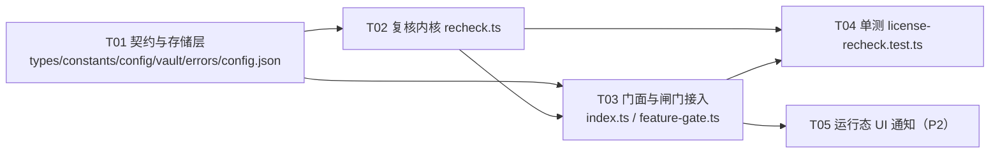

# ai-tools「定期联网复核授权状态」设计方案与任务分解

> 作者：架构师（高见远） · 面向：软件工程师实现
> 范围：仅客户端 `src/main/license/`，**本轮不改服务端**
> 口径：先核实事实再设计；未核实的一律标「未确认」，不下结论

---

## 0. 核实结论（先读这一节，后面的设计全部基于这些事实）

### 0.1 服务端 `billing-license-service` 复核端点：**存在，但与主理人的推测不同**

| 项 | 核实结果 | 证据 |
| --- | --- | --- |
| 端点 | `GET /api/licenses/verify/{licenseKey}`（**GET + 路径参数，不是 POST**） | `controller/LicenseController.java:58` |
| 鉴权 | **公开，无需登录** | `security/SecurityConfig.java:81` 已 `permitAll("/api/licenses/verify/**")` |
| 限流 | **60 次/分钟/IP**（`namespace=license-verify`）；超限返回 **429 且 body 为空** | `service/risk/RateLimitService.java:37-39,155-157`；`LicenseController.java:66` `ResponseEntity.status(429).<LicenseResponse>build()` |
| 成功响应 | 200，统一壳：`{success:true, code:"SUCCESS", data:{...}, traceId, timestamp}`；`data` 为 `LicenseResponse`：`id / licenseKey / customerEmail(=null) / productSku / status / issuedAt / expiresAt / lastVerifiedAt / machineCode / reissuedFrom / signedToken`。成功时 `status` **恒为 ACTIVE** | `dto/LicenseResponse.java`、`dto/ApiResponse.java`、`LicenseService#verifyLicense:233-274` |
| 失败响应 | **400**，`{success:false, code:"...", message, traceId, timestamp}`。业务码三种：`LICENSE_NOT_FOUND`（key 不存在）、`LICENSE_INVALID`（status ≠ ACTIVE，**含 REVOKED / REISSUED / 库内 signedToken 验签失败**）、`LICENSE_EXPIRED`（`expiresAt` 已过，顺带把库里置 EXPIRED） | `exception/GlobalExceptionHandler.java:41-47` + `LicenseService#verifyLicense` |
| 是否写库 | **是**。`@Transactional`，成功路径 `license.setLastVerifiedAt(now); licenseRepository.save(license)` → **每次成功复核一次 UPDATE** | `LicenseService.java:267-270` |
| 失败是否写库 | **是**。三条失败分支都 `recordLicenseEvent(VERIFY_FAILED)` → 写 `license_events` 一行 | `LicenseService.java:242,253,262` |
| 能否区分四态 | **能区分「正常 / 明确无效 / 明确过期」，但**：① 「明确吊销」与「服务端库内签名校验失败」同为 `LICENSE_INVALID`，**不可区分**；② 「key 不存在」是 `LICENSE_NOT_FOUND`，**不能**当作吊销处理 | 同上 |
| 有无 `serverTime` | **没有**（`LicenseResponse` 无此字段，与 `ActivateResponse` 不同）。客户端要时间口径只能用 HTTP `Date` 响应头 | `dto/LicenseResponse.java` |

### 0.2 退款 / 订阅到期链路：**服务端已有权威状态，客户端只需「问」**

- 退款：`AdminService` 渠道退款成功后，把该订单下所有 License 置 `REVOKED` + 写事件（`AdminService.java:267-281`）→ 复核会拿到 `LICENSE_INVALID`。✅
- 订阅取消：`SubscriptionService#expireLicense` 置 `EXPIRED`（`SubscriptionService.java:153-163`）→ 复核会拿到 `LICENSE_INVALID`（status 非 ACTIVE）。✅
- 结论：**「退款成功 / 订阅到期后要马上不能用」在服务端侧已经成立**，缺的只是客户端不问。

### 0.3 客户端现状

- `LicenseVault` 现有字段（`types.ts:135`）：`signed_token / activated_at / mid_at_activation / mid_soft_at_activation / watermark / server_time_floor / binding_reported`。**没有**任何「上次复核时间」字段。
- `vault.ts#sanitizeLicense`（`vault.ts:161`）是**白名单式解析**：`readVault()` 只输出 sanitize 里列出的键。**新增字段必须同步加进 sanitize，否则写入后读不出来**（主理人的提醒已核实为真）。
- 复核所需的 licenseKey **不用新增获取方式**：`verifier.ts#extractLicenseKeyFromToken(token)` 已存在（不验签直解 payload 的 `lic`），而服务端签发时无条件 `payload.put("lic", licenseKey)`（`LicenseIssuer.java:54`）。直接复用。
- 防时钟回拨的工具链已齐：`effectiveNow()` / `licenseFloor()` / `maxFloor()` / `raiseLicenseWatermark()` / `raiseLicenseServerFloor()` / `readAnchorFloor()` / `raiseAnchorFloor()`。**全部复用，不新造**。
- 后台 fire-and-forget 定时器已有先例：`machine-code.ts#warmupMachineCode`（`setTimeout` + `timer.unref()`）。**照抄这个形态**。
- `constants.ts:132` 已存在 `BACKGROUND_RECHECK_DELAY_MS`（机器码后台复核用），命名相近但语义不同，新常量不要复用它。

### 0.4 现行口径（plan-1.0，2026-09-28 起生效 —— **与本文下方 plan-7.0 草案冲突处，以本节为准**）

需求原文（川哥）：已激活状态下**每 15 天**问一次；问不到 **2 小时**后再问，持续到问到；**连续 60 天**问不到 → 自动变更为未激活；问的时候必须带机器码 + 产品 + license，三者不匹配 → 立即未激活。

| 维度 | plan-7.0 草案 | **现行（plan-1.0）** |
| --- | --- | --- |
| 心跳间隔 | 24h | `intervalMs` = **15 天**。**调参通道 = 包外 `license.config.json`**（改配置重启即生效，不发版）。服务端 verify 响应虽已下发 `nextCheckAfterMs`，但**客户端目前没有消费它**（`recheck.ts#VerifyData` 只取 `status`，`nextDelay()` 只读本地配置）——见 §7 待明确 15 |
| 问不到之后 | 仍 24h | `retryMs` = **2 小时**，直到拿到明确结论 |
| 429 | 1h + jitter | **与普通失败同节奏**：`retryMs`（2 小时）+ 0~10min jitter（审计 D3 定案，`rateLimitedRetryMs` 键已删除），且**照常消耗宽限** |
| 停用口径 | 方案 B（`offline_grace_used_ms` 钳制累加） | **方案 A（自然日，川哥 2026-09-24 拍板）**：`now - last_verified_ok_at`（缺失回落 `activated_at`）**现算** |
| 停用阈值 | `offlineGraceDays` 7 天单段 | **两段**：`offlineGraceDays` = 30 天 → 只进**提醒态**（`needsOnlineVerify`，功能不减）；`hardStopDays` = 60 天 → 才自动失效 |
| `offline_grace_used_ms` | 判定输入 | **退化为兼容字段**，不再参与判定（`applyVerdict` 里恒置 0） |
| 排期持久化 | 无 | 新增 vault 字段 `next_check_at`，**跨重启存活**（`startRecheckLoop` 首次延迟读它；缺失/过期 → 启动即查） |
| 启动首次复核 | `init()` 里 `void runRecheck()` | 只调 `startRecheckLoop()`，按 `next_check_at` 排期（省一次启动请求；回滚口径见 §7 第 14 条）。**审计 D1 加两条**：等待量夹到 `intervalMs` 上界；已进入提醒段则返回 `0` 启动即查 |
| 停用/提醒的时间基准 | 裸 `Date.now()` | **`max(nowMs, server_time_floor)`**（`recheck.ts#graceBaseline`）。**与到期判定故意不同**：到期用 `effectiveNow(...)` 三路下界，宽限只认服务端那一路，见 §1.5 第 1 条 |

三条由 15 天节奏**新引入**的护栏（plan-7.0 草案里没有）：

1. **阈值必须盖过一个完整心跳周期**：15 天间隔若配 7 天宽限，「隔一个周期没开机」就会在下次启动直接停用——纯结构性误杀，与网络好坏无关。`config.ts#mergeConfig` 对包外配置取下限 `ceil(intervalMs/天) + 5` 天，并保证 `hardStopDays >= offlineGraceDays`（写错就抬升并记 `recheck_*_days_clamped` 日志）。
2. **红线 4（本次进程未复核 → 不因超阈值停用）**：`isDisabledByRecheck(..., attemptPending)` 在「本进程还没问过服务端」时一律放行，`runRecheck` 在 fetch 之后、判定之前解除保护。否则「闲置 40 天后第一次启动」必被误杀，且断网时用户无法自救。服务端权威结论（`revoked_by_server=true`）**不受**此保护。
3. **长定时器分段**：`setTimeout` 的 delay 超过 2^31-1 ms（≈24.8 天）会被 Node 静默**截断成 1ms** → 排期到 30 天后会变成狂打服务端。`recheck.ts#scheduleNext` 按 24 天分段挂载。

同期新增的配套能力（不在 plan-7.0 草案范围内）：
`GET /api/licenses/pending?machineId=`（支付后按机器码领取直签授权，客户端 30 分钟窗口 / 60 秒心跳轮询，见 `purchase-poll.ts`）；收银台 URL 追加**产品码** `product=ai-tools`（档位由用户在收银台自选，不再传 `productId` 预选）；`MACHINE_MISMATCH` 等三类业务码走 `publicErrorFor` 白名单并引导至授权管理页 `/account/`。

---

## 1. 实现方案

### 1.1 总思路（一句话）

**用现成的 `GET /api/licenses/verify/{licenseKey}` 做「问一句」；服务端明确说「无效/过期」→ 立即停用；服务端答不上来（网络/5xx/429/畸形/未知码）→ 按 `retryMs`（2 小时）重试直到问通，同时按自然日消耗离线宽限；超过 30 天进提醒态、超过 60 天才停用。停用一律是「软失效 + 可自愈」。

### 1.2 状态机（5 个新 vault 字段 + 1 个纯函数判定）

新增字段（`LicenseVault`，全部可选 → **老 vault 无需迁移**）：

| 字段 | 类型 | 语义 |
| --- | --- | --- |
| `last_checked_at` | `number \| null` | 上次**发起**复核的时刻（不论成败），ms。单调只增 |
| `next_check_at` | `number \| null` | 下次复核排期时刻，ms。跨重启存活的关键（**必须登记进 `sanitizeLicense` 白名单**） |
| `last_verified_ok_at` | `number \| null` | 上次服务端**明确回答 ACTIVE** 的时刻，ms。**方案 A 的停用/提醒判定基准**（缺失回落 `activated_at`） |
| `offline_grace_used_ms` | `number` | 已消耗的离线宽限，ms，默认 0。**plan-1.0 后退化为兼容字段**：恒置 0，不参与判定 |
| `revoked_by_server` | `boolean \| null` | 服务端明确回答吊销/过期 → 本地停用标记 |

复核四态 `RecheckVerdict`：

```
'active'   → 200 且 data.status === 'ACTIVE'
'revoked'  → 400 且 code ∈ { LICENSE_INVALID, LICENSE_EXPIRED }   ← 唯一能立即停用的态
'unknown'  → 其它一切：网络失败/超时/5xx/429/JSON 畸形/非 200 非 400/LICENSE_NOT_FOUND/未知码
'skipped'  → 无本地 token / extractLicenseKeyFromToken 取不到 / cfg.recheck.enabled=false
```

状态迁移（每次 `runRecheck`；**现行形态以 §0.4 为准**，下面的 `unknown` 分支已改为方案 A 现算，不再累加 `used`）：

```
active  : used = 0 ; revoked_by_server = false ; last_verified_ok_at = last_checked_at = now
revoked : revoked_by_server = true ; last_checked_at = now
unknown : last_checked_at = max(last_checked_at ?? 0, now)   // 单调，防回拨
          是否停用交由 isDisabledByRecheck 现算（不写 used）
skipped : 一切不动
每次落盘同时写 next_check_at = now + 下次间隔（15 天 / 2 小时；429 同 2 小时另加 0~10min jitter）
```

**停用判定统一出口**（`getState` 与 `assertFeature` 共用，避免两处漂移）：

```ts
export function isDisabledByRecheck(
    license: LicenseVault | null,
    cfg: LicenseConfig,
    nowMs: number = Date.now(),
    attemptPending: boolean = hasPendingRecheckAttempt(),
): boolean {
    if (!license || !cfg.recheck.enabled) return false;   // 开关判断放这里：新增调用点不会漏
    if (license.revoked_by_server === true) return true;  // 服务端权威结论，不受红线 4 保护
    if (attemptPending) return false;                     // 红线 4：本次进程还没问过服务端 → 不误杀
    const elapsed = elapsedSinceLastOkMs(license, graceBaseline(license, nowMs)); // 基准见 §1.5 第 1 条
    if (elapsed === null) return false;                   // 老 vault 连 activated_at 都没有 → 不误杀
    return elapsed >= cfg.recheck.hardStopDays * 86_400_000;
}
```

`isRecheckAttentionNeeded()`（提醒段，超 `offlineGraceDays` 未达 `hardStopDays`）与上面**共用同一个 `graceBaseline`**，避免「停用判定了但提醒没亮」的两套基准漂移。

### 1.3 关键取舍 ①：轮询定时器放哪

**放在 `src/main/license/recheck.ts`（新文件），由 `license/index.ts#init()` 启动。**

- 形态：**递归 `setTimeout`**（不是 `setInterval`）——因为不同 verdict 的下次间隔不同（15 天 / 失败重试 2 小时 / 429 同 2 小时但加抖动），递归更好表达；每个 timer 都 `unref()`，不阻止进程退出（与 `warmupMachineCode` 同口径）。
- 调度：`scheduleNext(delayMs)`（现行口径见 §0.4）
  - `active` / `revoked` / `skipped` → `intervalMs`（15 天）
  - `unknown` 且 `httpStatus === 429` → `retryMs`（2 小时）+ 随机 0~10min jitter（审计 D3：与普通过失败同节奏，抖动只防「同一 NAT 出口同步重试风暴」）
  - 其它 `unknown`（没拿到结论）→ `retryMs`（**2 小时**，plan-1.0 第 2 条；不可并进 15 天，否则「失败后 2 小时重试」这条需求就丢了）
  - delay > 24 天 → **分段挂载**（`setTimeout` 超 2^31-1 ms 会被截断成 1ms）
- 排期落盘：每次复核把「下一次发起时刻」写进 `LicenseVault.next_check_at`，`startRecheckLoop()` 读它 → 15 天节奏与 2 小时重试**跨重启存活**。
- 启动首次复核：`init()` 只调 `startRecheckLoop()`，不再额外 `void runRecheck()`（否则启动并发两个请求，白耗限流额度）。
- **首次延迟 `initialDelay()` 的现行三条**（审计 D1）：① 已进入提醒段（`isRecheckAttentionNeeded`）→ 返回 `0`，**启动即查**，省得「出差回来第一次启动只亮横幅、要等排期点」；② 未到点时把等待量**夹到 `intervalMs` 上界**——系统时间往回调后 `next_check_at - now` 可以是任意大的正数，而分段定时器等的是真实时间，不夹上界等于把首查无限推迟，红线 4 的启动保护随之变成「永不停用」后门；③ 任何异常都退化成「立即查」，绝不影响启动。
- 进程内单例：模块级 `loopTimer`，`startRecheckLoop()` 重复调用先 `clearTimeout`，并把 `attemptPending` 重新置真（红线 4 的启动保护随之重新生效）。
- 纯逻辑 `runRecheck(nowMs = Date.now())` 独立导出 → 单测可直接调，不依赖定时器。

### 1.4 关键取舍 ②：宽限如何判定（**已定案：方案 A + 30/60 分段，plan-7.0 草案推荐 B 的部分作废**）

> 本节原先逐行对比「方案 A 自然日 / 方案 B 使用时长钳制累加」，两套阈值（7 天、24h 心跳）都已作废，
> 保留会与本节下方的定案和 §0.4 现行口径互相矛盾。差异对比只留一句：**B 的唯一卖点是「长期不开机不消耗宽限」，
> 15 天节奏 + 30/60 分段已经覆盖同一场景**；现行阈值与字段见 §0.4。

**定案（川哥 2026-09-24 拍板方案 A；plan-1.0 用分段阈值解决 B 想白送的误伤场景）**：

- B 方案的唯一卖点是「长时间不开机不消耗宽限」。plan-1.0 把节奏拉长到 15 天后，A 方案的那个致命场景（出差回来即停用）已经不存在——30 天提醒段 + 60 天硬停本身就盖过了「一个周期没开机」，不需要 `min(elapsed, intervalMs)` 钳制。
- A 方案的判定是**纯函数现算**（`now - last_verified_ok_at`），没有「累加器被写坏/被回拨」的中间状态可篡改，攻击面比 B 小；`offline_grace_used_ms` 退化为兼容字段，不再参与判定。
- B 担心的「睡眠/休眠定时器漂移」在 A 下不适用：A 不看定时器走了几次，只看真实经过天数。
- 代价（已知情，写在这里防日后误读为缺陷）：**服务端吊销/退款后，本地最迟 `hardStopDays`（60 天）才生效**（plan-7.0 的 7 天口径为 ≤7 天）。缓解手段是 30 天起的提醒态（`needsOnlineVerify`）与包外开关 `recheck.enabled=false` 秒级回滚。

**不冲突说明**：15 天间隔与 30/60 天分段**本身没有技术冲突**——分段只覆盖「服务端答不上来」，服务端明确答「吊销」是立即停，不受宽限影响。

### 1.5 关键取舍 ③：时钟回拨怎么防（全部复用既有实现）

1. **两套基准，别混用**（审计 D1 定案）：
   - **到期判定**（`getState` / `assertFeature` / `verifyToken` 的 `nowMs`）用 `effectiveNow(trial, now, maxFloor(licenseFloor(license), await readAnchorFloor()))`，**禁止裸 `Date.now()`**——三路下界都会随本地时间推进，能最大限度封死「改回时间续命」。
   - **宽限/停用/提醒判定**用 `recheck.ts#graceBaseline(license, nowMs) = max(nowMs, license.server_time_floor)`，**只认服务端 HTTP `Date` 抬高的那一路下界**。理由：`watermark` 与 vault 外锚会被「用户偶然把时钟往前调」永久抬高再回落，若拿它当宽限基准，回来就成「60 天没复核」的假象 → **付费用户被误杀（红线 2）**；而 `server_time_floor` 只由 `raiseLicenseServerFloor`（redeem / verify 响应的 HTTP `Date`）推进，本机改不动，足以封死回拨续命。
   - 结论：**到期可以宽松（往大了抬），宽限必须保守（只信服务端）**。这两条不对称是设计意图，不是笔误，日后勿「顺手统一」。
2. `last_checked_at` 只增不减；`elapsed` 取 `max(0, ...)` → 回拨时宽限**不会倒退也不会暴涨**。
3. 复核成功时读 HTTP `Date` 响应头（GMT，无时区歧义）→ `raiseLicenseServerFloor(license, dateMs)` 抬高 `server_time_floor`（**已存在的函数，直接复用**）。拿不到就跳过，不影响主流程。
4. `revoked_by_server` 一旦置 true，**只有下次复核成功才能清 false**，本地改时间无法复活。
5. 停用后**继续按 `intervalMs`（15 天）轮询** → 若属误判，服务端恢复后自动自愈（`applyVerdict` 的 active 分支会清 `revoked_by_server`）。

### 1.6 停用如何生效（「马上不能用」的两个闸门）

- **`getState()`**：停用判定**必须放在 `verifyToken()` 之前**（见下方「优先级」），命中则返回 `{...baseState(), machineCode, degraded: 'token_invalid'}`（即 `status:'inactive'`）。**不停用时不改动任何返回**。
- **`assertFeature()`**：在 `verifyToken` 成功后追加同一检查 → true 则 `{allowed:false, code:'LIC_RECHECK_REVOKED', payload:null}`。这是云同步等付费功能的真实闸门。
- **不清 vault、不删 token、不清 trial** → 用户重新联网复核成功即恢复（自愈），或重新激活。
- 对外文案：`degraded: 'token_invalid'`（该值已存在于 `ActivationDegradedReason`），复用既有引导 UI。**不新增、不回传任何服务端错误码**。

**⚠️ 优先级（易漏）：停用判定必须压过「硬件变更宽限」**

`getState()` 现有分支里，`LIC_MACHINE_MISMATCH` 会走 `resolveHardwareGrace()` 并返回 `status:'activated'`
（再给 7 天硬件宽限）。若把停用闸门只挂在「验签成功分支」，则出现真实绕过：
**退款用户换一块硬盘 → 旧 token 验签机器码不匹配 → 命中硬件宽限 → 又获得 7 天可用期。**

因此 `getState()` 的插入点固定为：

```ts
if (token) {
    const floor = maxFloor(licenseFloor(vault.license), await readAnchorFloor());
    // ① 先推进水印与锚（防回拨，不受停用影响）
    const raised = raiseLicenseWatermark(vault.license, now);
    if (raised) await writeVault({trial: vault.trial, license: raised});
    await raiseAnchorFloor(now);
    const license = raised ?? vault.license;
    // ② 再判停用：优先级高于验签/硬件宽限
    if (isDisabledByRecheck(license, cfg)) {
        payloadCache = null;                       // 见下「会话缓存」
        return {...baseState(), machineCode: pair.strong, degraded: 'token_invalid'};
    }
    // ③ 才走原有验签流程（含 LIC_MACHINE_MISMATCH → 硬件宽限）
    const outcome = await verifyToken(token, {nowMs: effectiveNow(vault.trial, now, floor)});
    ...
}
```

**会话内载荷缓存必须一并清**（`payloadCache`）：其唯一外部消费点是
`src/main/updater.ts:79 → evaluateUpdateEntitlement(currentPayload(), ...)`。

> ⚠️ **理由准确口径（2026-09-24 修正，由 software-engineer 指出原表述有误）**：
> `update-gate.ts:27` 是 `payload === null → **放行** 更新**。因此清空的实际效果是
> 「**放宽**更新、去掉陈旧 `update_until` / `max_major_version` 造成的误拦」，
> **不是**收紧更新权限。停用后用户在语义上等同未激活，而 `update-gate.ts:24` 的设计口径
> 本就是「买断 / 未激活 / 试用（payload 为 null）不受限」——放行更新是自洽的。
> 另：`assertFeature` 每次走 `verifyToken` **现算**（`feature-gate.ts:70`），不读 `payloadCache`，
> 故付费功能闸门不受此项影响，清空只作用于更新软门控。
>
> **产品决策（本轮拍板）**：接受「停用后放行更新」。若产品意图是「退款用户不得再拿到更新」，
> 清 `payloadCache` 是**错的工具**——需把停用状态传进 `evaluateUpdateEntitlement`（改签名或加参数），
> 属独立产品决策，**本轮不做**（见 §7 待明确 11）。

```ts
// feature-gate.ts 停用分支：payload 一律 null
return {allowed: false, code: 'LIC_RECHECK_REVOKED', payload: null};

// license/index.ts#assertFeature
if (result.code === 'LIC_RECHECK_REVOKED') payloadCache = null;
else if (result.payload) payloadCache = result.payload;
```

**去激活（`deactivate()`）的字段处置（现行实现，见 §7 第 10 条）**：早先草案打算「靠字面量漏写来重置」，
已废弃——那条太脆弱（漏一个键就静默继承旧状态），且把「保留 `watermark` / `server_time_floor`」这个后来拍板的
安全语义误伤掉（改系统时间 + 重新激活可回拨续命）。现行是**显式列出该清的键**：

```ts
license: {
    ...vault.license,
    signed_token: null, activated_at: null,
    mid_at_activation: null, mid_soft_at_activation: null,
    revoked_by_server: false, offline_grace_used_ms: 0,
    last_checked_at: null, last_verified_ok_at: null,
    next_check_at: null,          // 去激活后不该沿用上一张授权的 15 天节奏
    binding_reported: null,       // 换 token 需重新上报绑机
    // watermark / server_time_floor 故意保留：反回拨的单调下界
}
```

### 1.7 误判停用是资损级事故 —— 七道「宁可放过也不误杀」

1. **白名单码**：只有 `LICENSE_INVALID` / `LICENSE_EXPIRED` 两个码能立即停用。`LICENSE_NOT_FOUND`（key 不存在 —— 可能是服务端数据迁移/恢复）、`429`、`5xx`、网络失败、超时、JSON 畸形、非 200/400 状态码 → **一律 unknown 走宽限**。
2. **429 必须照常计入离线宽限**（**不可**因「服务端在限流」就免扣）：否则攻击者只要对自身出口 IP 打满 verify 限流（60/min），客户端就永远只能拿到 429 → **永不停用，限流直接变成永久续命后门**。方案 A 下这条天然成立：429 只让 `last_verified_ok_at` 不推进，真实天数照常在 `hardStopDays`（60 天）后触发停用。429 的下次调度与普通失败同走 `retryMs`（2 小时）+ 0~10min jitter（审计 D3 删掉了独立的 `rateLimitedRetryMs` 键；缩短退避**不影响**本条，因为守护本条的是「不刷新 `last_verified_ok_at`」而非退避时长）。
3. **不设「二次确认」**（原 `doubleConfirm` 已**取消**）：它防不住想防的东西——服务端系统性错误或代理缓存的错误响应，第二次请求会命中同样的结果；反而引入「第一次明确吊销 + 第二次 429」这类定义不清的中间态，以及上述限流后门。防误杀靠本条目的其余五道。
4. **异常绝不上抛**：`runRecheck` 全流程 `try/catch`，任何异常 → `unknown`，绝不影响主进程。
5. **软失效**：只置标记，不销毁任何数据。
6. **持续自愈**：停用后仍按 `intervalMs` 轮询，服务端恢复即复活。
7. **秒级回滚开关**：`license.config.json` 的 `recheck.enabled=false` → `getState` / `assertFeature` **完全忽略停用标记**，已停用用户重启即恢复。这是资损事故的第一处置手段（改包外配置，不需发版）。

---

## 2. 文件清单（按依赖与实现顺序）

| # | 路径 | 改动 | 说明 |
| --- | --- | --- | --- |
| 1 | `src/main/license/types.ts` | 改 | `LicenseConfig` 新增 `recheck: RecheckConfig`（6 键：`enabled` / `intervalMs` / `retryMs` / `offlineGraceDays` / `hardStopDays` / `timeoutMs`；审计 D3 已删除第 7 键 `rateLimitedRetryMs`，包外配置里的残留键会被 `mergeConfig` 忽略）；`LicenseVault` 新增 5 个可选字段（含注释说明老 vault 无需迁移） |
| 2 | `src/main/license/constants.ts` | 改 | 新增 `LICENSE_VERIFY_API_PATH(licenseKey)`、`DEFAULT_RECHECK_*` 一组常量 |
| 3 | `src/main/license/config.ts` | 改 | `cloneDefault()` + `mergeConfig()` 解析 `recheck` 段（字段级兜底、非法值回落默认，与既有风格一致） |
| 4 | `src/main/license/vault.ts` | 改 | **`sanitizeLicense()` 白名单里登记 5 个新字段**（`last_checked_at` / `last_verified_ok_at` / `offline_grace_used_ms` / `revoked_by_server` / `next_check_at`；漏了就写进去读不出来——`next_check_at` 曾漏登，导致跨重启排期静默失效） |
| 5 | `src/main/license/errors.ts` | 改 | `LicenseErrorCode` 追加：`LIC_RECHECK_NETWORK` / `LIC_RECHECK_RATE_LIMITED` / `LIC_RECHECK_BAD_RESPONSE` / `LIC_RECHECK_REVOKED` / `LIC_RECHECK_GRACE_EXHAUSTED` / `LIC_RECHECK_UNKNOWN` |
| 6 | `src/main/license/recheck.ts` | **新增** | 复核内核：网络请求 + 响应四态分类 + 停用阈值现算（方案 A）+ 排期落盘 + 递归定时器（长 delay 分段挂载） |
| 7 | `src/main/license/index.ts` | 改 | ① `init()` 内**只**调 `startRecheckLoop()`（不再额外 `void runRecheck()`，首次延迟由 `next_check_at` 决定）；② `getState()` 内停用闸门（**插在 `verifyToken` 之前，压过硬件宽限**，见 §1.6）+ 提醒态 `needsOnlineVerify`；③ `deactivate()` 显式处置复核字段；④ `applySignedToken()` 显式重置复核字段（新授权不继承旧停用标记）；⑤ `assertFeature` 命中停用时清 `payloadCache`；⑥ 导出 `setStateChangeListener()` + `setRecheckDisableHook(notifyStateChanged)` |
| 8 | `src/main/license/feature-gate.ts` | 改 | `assertFeature()` 验签通过后追加 `isDisabledByRecheck()` 闸门 |
| 9 | `src/main/license/assets/license.config.json` | 改 | 补 `recheck` 段默认值 |
| 10 | `src/__tests__/license-recheck.test.ts` | **新增** | 单测（见 T04） |
| 11 | `src/main/index.ts` | 改 | 注册状态变化广播：`license.setStateChangeListener(state => …webContents.send('activation:state-changed', state))`（P2 已落地） |
| 12 | `src/preload/index.ts`、`src/shared/activation-types.ts`、`src/renderer/src/store/activationStore.ts` | 改 | `onStateChanged(cb)` 订阅 + store 更新（运行中被停用/进入提醒态的 UI 反馈，P2 已落地） |
| 13 | `src/main/license/redeem.ts`、`purchase-poll.ts`、`verifier.ts` | 配套 | plan-1.0 的配套能力：收银台 URL 带**产品码** `?machineId=&product=ai-tools`（走新常量 `PRODUCT_CODE`；**不预选 `productId`**，档位/SKU 由用户在收银台自选，见 §7 第 13 条）、按机器码领取待激活授权（`fetchPendingLicenses`）+ 支付后轮询、错误码白名单 `publicErrorFor` 与「打开授权管理页」引导。详见 `D:/ProductSpace/plan-1.0.md` |

---

## 3. 数据结构与接口

### 3.1 类型（`types.ts`）

```ts
/** 定期复核配置（包外 license.config.json 可覆盖，无需发版） */
export interface RecheckConfig {
    /** 总开关；关掉后 getState/assertFeature 完全忽略停用标记（资损事故回滚手段） */
    enabled: boolean;
    /** 复核间隔（ms），默认 15 天；调参走包外 license.config.json（服务端下发的 nextCheckAfterMs 暂未消费，见 §7 第 15 条） */
    intervalMs: number;
    /** 复核「拿不到明确结论」后的重试间隔（ms），默认 2 小时（持续到成功为止；429 同节奏，另加 0~10min 抖动） */
    retryMs: number;
    /** 进入「需联网验证」提醒段的天数阈值（提醒但不减功能），默认 30 天 */
    offlineGraceDays: number;
    /** 自动失效（未激活）的天数阈值，默认 60 天 */
    hardStopDays: number;
    /** 单次请求超时（ms），默认 8000（比 redeem 15s 短：启动路径上的旁路请求） */
    timeoutMs: number;
}

export interface LicenseVault {
    // ...既有字段不变
    /** 上次发起复核的时刻（不论成败），ms；单调递增，防回拨 */
    last_checked_at?: number | null;
    /** 下次复核排期时刻（ms）。`runRecheck` 与 `startRecheckLoop` 共用 → 15 天节奏/2 小时重试跨重启存活 */
    next_check_at?: number | null;
    /** 上次服务端明确回答 ACTIVE 的时刻，ms；**方案 A 的停用/提醒判定起点**（缺失回落 `activated_at`），
     *  终点由 `graceBaseline()=max(now, server_time_floor)` 给出（见 §1.5 第 1 条） */
    last_verified_ok_at?: number | null;
    /** 已消耗的离线宽限（ms），默认 0；**plan-1.0 后退化为兼容字段**，恒置 0，不参与判定 */
    offline_grace_used_ms?: number;
    /** 服务端明确回答吊销/过期 → 本地停用；只有复核成功才清 false */
    revoked_by_server?: boolean | null;
}
```

> `RecheckConfig` 现共 **6 键**（原第 7 键 `rateLimitedRetryMs` 已随审计 D3 删除）：429 与普通失败同用 `retryMs`，
> 只在下次调度时额外叠加 0~10min 抖动。包外 `license.config.json` 若仍残留该键，`mergeConfig` 直接忽略（`license-recheck-config.test.ts` 用例 2 守住）。

### 3.2 对外 API（`recheck.ts`）

```ts
export type RecheckVerdict = 'active' | 'revoked' | 'unknown' | 'skipped';

export interface RecheckOutcome {
    verdict: RecheckVerdict;
    /** HTTP 状态码；null = 网络层失败（fetch 抛异常/超时） */
    httpStatus: number | null;
    /** 服务端业务码（LICENSE_INVALID 等），仅日志，绝不上屏 */
    serverCode: string | null;
    /** 本次是否触发停用 */
    disabled: boolean;
    /** 落盘后的累计已耗宽限（ms） */
    graceUsedMs: number;
}

/** 执行一次复核（纯逻辑，单测直接调；内部全流程 try/catch，绝不抛） */
export async function runRecheck(nowMs: number = Date.now()): Promise<RecheckOutcome>;

/** 启动后台循环（进程内单例；timer.unref()） */
export function startRecheckLoop(): void;

/** 停止循环（测试/退出） */
export function stopRecheckLoop(): void;

/**
 * 停用判定唯一出口：getState 与 assertFeature 共用。
 * revoked_by_server = true（权威结论，不受红线 4 保护）
 *   或（本次进程已发起过复核 且 闲置天数 >= hardStopDays）
 * `attemptPending` 默认读模块状态，单测显式传入以获得确定性。
 */
export function isDisabledByRecheck(
    license: LicenseVault | null,
    cfg: LicenseConfig,
    nowMs?: number,
    attemptPending?: boolean,
): boolean;

/** 提醒态判定：闲置 >= offlineGraceDays 且 < hardStopDays → needsOnlineVerify（功能不减） */
export function isRecheckAttentionNeeded(
    license: LicenseVault | null,
    cfg: LicenseConfig,
    nowMs?: number,
): boolean;

/** 本次进程是否还没发起过复核尝试（红线 4） */
export function hasPendingRecheckAttempt(): boolean;

/** 停用钩子（门面注入 notifyStateChanged，避免 index ↔ recheck 循环依赖） */
export function setRecheckDisableHook(fn: (() => void) | null): void;
```

### 3.3 内部函数（`recheck.ts`，不导出）

```ts
const REVOKED_CODES = new Set<string>(['LICENSE_INVALID', 'LICENSE_EXPIRED']);

interface VerifyResponse {
    httpStatus: number | null;   // null = 网络失败
    code: string | null;         // 统一壳的 code（失败段）或 'SUCCESS'
    status: string | null;       // data.status（'ACTIVE' / ...）
    serverTimeMs: number | null; // HTTP Date 响应头解析值
}

/** GET /api/licenses/verify/{licenseKey}；429 无 body 必须先判 status 再 json() */
async function fetchLicenseStatus(licenseKey: string): Promise<VerifyResponse>;

function classify(res: VerifyResponse): RecheckVerdict;

/** 按 verdict 更新复核字段（排期 `next_check_at` 由 `runRecheck` 在同一次 writeVault 里补齐） */
function applyVerdict(
    license: LicenseVault,
    verdict: RecheckVerdict,
    nowMs: number,
    serverTimeMs: number | null,
): {license: LicenseVault; disabled: boolean};

/** 由 outcome 算下次间隔：429→retryMs+抖动；其它 unknown→retryMs；其余（active/revoked/skipped）→intervalMs（纯本地配置，见 §7 第 15 条） */
function nextDelay(outcome: RecheckOutcome): number;

/** 递归 setTimeout + unref；delay 由 verdict 决定（15 天 / 2 小时，429 另加抖动），超 24 天分段挂载 */
function scheduleNext(delayMs: number): void;

/**
 * 宽限/停用/提醒判定的**终点时刻**：`max(nowMs, license.server_time_floor)`。
 * 只认服务端 HTTP Date 抬高的那一路下界——`watermark`/anchor 会被本地前拨永久污染，
 * 用作宽限基准会把偶尔调过时间的付费用户直接判成「60 天没复核」（红线 2）。
 */
function graceBaseline(license: LicenseVault, nowMs: number): number;

/** 首次延迟：① 已进提醒段→0（启动即查）②未到点→等待量夹到 intervalMs 上界 ③已过点/无值/任何异常→0 */
async function initialDelay(): Promise<number>;
```

**响应解析要点（照抄 `machine-probe.ts` 的兼容写法）**：服务端统一壳 → 先取 `body.data ?? body`；`429` 无 body 必须**先判 `response.status` 再 `response.json()`**，否则 `json()` 抛异常会被误当成 unknown（结果一致但日志会误报 `BAD_RESPONSE`，不利排查）。

### 3.4 门面新增（`index.ts`）

```ts
/** 状态变化监听（运行中被停用时通知渲染层）；传 null 注销。P2 可选 */
export function setStateChangeListener(fn: ((state: ActivationState) => void) | null): void;

/**
 * 手动复核（审计 D4：提醒横幅的「立即联网验证」出口）。
 * 只把 runRecheck 的四态收敛成 `ManualRecheckResult = 'verified' | 'unverified' | 'disabled' | 'skipped'`，
 * **服务端业务码绝不跨 IPC 上屏**——渲染层拿到的仍是文案 key，走既有 i18n。
 * IPC：`activation:recheck-now`（`main/index.ts`）→ preload `recheckNow()` → 浏览器预览态 mock 返回 'unverified'。
 */
export function recheckNow(): Promise<ManualRecheckResult>;
```

---

## 4. 程序调用流程

完整时序见 `doc/license-recheck-sequence.mermaid`，类/接口关系见 `doc/license-recheck-class.mermaid`。

主干文字版：

1. `main/index.ts` → `license.init()` → `warmupMachineCode()` + `startRecheckLoop()`（fire-and-forget；首次延迟由 vault 的 `next_check_at` 决定）。
2. `runRecheck()` → `readVault()` → `extractLicenseKeyFromToken(signed_token)` → 无 token/key 或开关关闭 → `skipped` 返回。
3. `fetchLicenseStatus(key)` → `markAttemptDone()`（解除红线 4）→ `classify()` → `applyVerdict()` → `writeVault()`（同一次写入 `next_check_at`）。
4. `verdict === 'revoked'` 或宽限耗尽 → 调 `setRecheckDisableHook` 注入的回调广播状态。
5. `scheduleNext(nextDelay(outcome))`。
6. 之后每次 `getState()` / `assertFeature()` 都会过 `isDisabledByRecheck()` 闸门；`getState()` 另过 `isRecheckAttentionNeeded()` 置提醒态 `needsOnlineVerify`（不减功能）。
7. 支付到账旁路：打开收银台 → `startPurchasePolling()` → 每 60s 问 `/api/licenses/pending?machineId=` → 命中即本地验签落盘激活（窗口 30 分钟，细节见 plan-1.0）。

---

## 5. 风险与回滚

| 风险 | 等级 | 处置 |
| --- | --- | --- |
| **误判停用（资损级）** | 高 | 七道防线见 §1.7：白名单码 + 429 照常消耗宽限 + 异常兜底 + 软失效 + 自愈 + 配置秒级回滚 + 红线 4（本次进程未问过就不停用） |
| 服务端数据恢复/迁移导致全体 `LICENSE_NOT_FOUND` | 高 | `LICENSE_NOT_FOUND` **明确归入 unknown**（不停用），只走宽限 |
| 服务端轮换签名密钥但库内 token 未重签 → 全体 `LICENSE_INVALID` | 中 | 同上（这是唯一能"全体误杀"的码）；**需向服务端确认**（见 §7 待明确 3），本轮靠软失效 + 自愈 + 配置回滚兜底 |
| 企业 NAT 出口 IP 集中启动 → 429 | 中 | 429 → unknown（不停用）+ 2h 退避 + 0~10min jitter；用户零影响，只是当天首查失败 |
| **429 若免扣宽限 → 限流变成永久续命后门** | 高 | 429 **必须照常消耗宽限**（§1.7 第 2 条）；这是本方案唯一能被攻击者主动利用的口子 |
| **退款后换硬件 → 硬件宽限绕过停用** | 高 | 停用判定插在 `verifyToken` 之前、优先级高于 `resolveHardwareGrace`（§1.6）。已修，实现时勿放错位置 |
| 已吊销授权被客户端持续复核 → 服务端持续写 `license_events(VERIFY_FAILED)` | 中 | 15 天节奏已把频次降到 ~1/15；**仍需服务端配合**按 `(licenseId, 日期)` 去重或对该场景不写事件（见 §7 待明确 1） |
| 每次成功复核一次 DB UPDATE | 低 | 1 次/license/**15 天**；1 万活跃 ≈ 0.008 QPS 均值，可忽略 |
| 系统睡眠导致定时器漂移 | 低 | 递归 `setTimeout` 基于真实时间，唤醒后触发；方案 A 按自然日现算，漂移不额外消耗宽限 |
| **`setTimeout` 长 delay 被 32 位截断** | 高 | delay > 2^31-1 ms（≈24.8 天）会被 Node/浏览器**静默截断成 1ms** → 15 天节奏变成每毫秒打一次服务端。`scheduleNext` 以 `MAX_TIMER_MS`（24 天）分段挂载；单测用例 21 用 30 天排期作为回归闸 |
| 用户改系统时间规避 | 低 | 复用 `effectiveNow` + `server_time_floor`(HTTP Date) + `anchor` 三路下界；`revoked_by_server` 只能由复核成功清除。**宽限/停用判定只认 `server_time_floor` 一路**（`graceBaseline`，见 §1.5 第 1 条）——三路都用会把偶尔前拨过时间的付费用户误杀 |
| **回拨 + 排期推迟 = 红线 4 变永不停用后门** | 高 | 审计 D1 两处封堵：`initialDelay()` 将等待量夹到 `intervalMs` 上界（回拨后 `next_check_at - now` 可任意大）；停用/提醒基准取 `max(now, server_time_floor)`，服务端时间不会因本机回拨而倒退 |
| 停用后 `payloadCache` 残留旧载荷 | 低 | 停用分支显式 `payloadCache = null`。效果是**放宽**更新（去掉陈旧 `update_until` 的误拦），与 `update-gate`「未激活不受限」口径自洽；**不是**收紧更新权限。仅影响更新软门控，付费功能闸门走现算验签不受影响 |
| 本次改动引入新崩溃点 | 低 | 全程 fire-and-forget + try/catch；复核失败不影响任何既有判定路径 |
| **回滚** | — | ① 包外配置 `recheck.enabled=false` → 重启即恢复（首选，不需发版）；② `git revert` 发版回滚；③ 以上都不依赖本地数据，vault 未破坏 |

---

## 6. 任务分解（有序，含依赖）

| 任务 | 名称 | 文件 | 依赖 | 优先级 |
| --- | --- | --- | --- | --- |
| **T01** | 契约与存储层：类型 / 常量 / 配置解析 / vault 白名单 / 错误码 / 默认配置 | `license/types.ts`、`license/constants.ts`、`license/config.ts`、`license/vault.ts`、`license/errors.ts`、`license/assets/license.config.json` | — | **P0** |
| **T02** | 复核内核 `recheck.ts`：网络请求 + 四态分类 + 停用阈值现算（方案 A，429 照常消耗宽限）+ 排期落盘 + 分段定时调度 | `license/recheck.ts`（新增） | T01 | **P0** |
| **T03** | 门面与闸门接入：`init` 启动循环、`getState`/`assertFeature` 停用闸门（**优先级高于硬件宽限**）、`deactivate` 与 `applySignedToken` 字段重置、`payloadCache` 清理、状态监听出口 | `license/index.ts`、`license/feature-gate.ts` | T01, T02 | **P0** |
| **T04** | 单测 `license-recheck.test.ts`（另配套 `license-recheck-config.test.ts`、`license-purchase-poll.test.ts`、`activation-store-broadcast.test.ts`）：四态分类、30/60 分段阈值、429/5xx/网络、回拨防复活、停用与自愈、开关关闭、停用压过硬件宽限、排期跨重启、红线 4、长定时器分段 | `src/__tests__/license-recheck*.test.ts` 等（新增） | T02, T03 | **P0** |
| **T05** | 运行态 UI 通知（P2）：主进程广播 → preload 订阅 → 渲染层 store 更新 | `src/main/index.ts`、`src/preload/index.ts`、`src/shared/activation-types.ts`、`src/renderer/src/store/activationStore.ts` | T03 | P1 |

**T04 验收口径（现行 26 例，含 15a/b/c、23a/b 子例；分组；具体断言以 `src/__tests__/license-recheck.test.ts` 为准）**

- **四态分类（1–7）**：200+ACTIVE → active（刷新 `last_verified_ok_at`、清 `revoked_by_server` = **停用后自愈**）；400+`LICENSE_INVALID` / `LICENSE_EXPIRED` → revoked 单次即停用（无二次确认）；400+**`LICENSE_NOT_FOUND`** → unknown 不停用（核心防误杀）；429 空 body → unknown（必须先判 status 再 json）；网络/超时抛异常 → unknown；JSON 畸形 → unknown。
- **阈值分段（8–10、22）**：停用阈值 = `hardStopDays`（阈值前一天 false、当天 true）；`last_verified_ok_at` 缺失回落 `activated_at`，两者皆无 → 不误杀；`revoked_by_server=true` 无视红线 4 与宽限一律禁用；纯函数按配置原样判定，阈值大小关系由 config 层 clamp 保证（用例 22）。
- **闸门消费点（11–12）**：`getState` 停用闸门压过验签（token 合法也返回 `token_invalid`）；`deactivate()` 清空 5 个复核字段（含 `next_check_at`）但**保留** `watermark` / `server_time_floor`。
- **开关 / 排期 / 宽限耗尽（13–21）**：`recheck.enabled=false` → 恒不停用且 `runRecheck` 直接 skipped 不发请求；连续 429 跨过 `hardStopDays` 当天停用（`revoked_by_server` 仍 false，证明限流不能续命）；排期落盘 unknown→`+retryMs`、active→`+intervalMs`、429→`+retryMs`+0~10min 抖动；红线 4 未问过不停用（纯函数 16、`getState` 消费 21，其中 21 用 30 天排期同时守住 `setTimeout` 32 位截断回归）；红线 4 解除（闲置 90 天 + 本次问不到 → 本次即停用）；提醒段（18 纯函数 / 19 `getState` 仍 activated、功能不减、只置 `needsOnlineVerify`）；排期跨重启（20：未到点不请求、已过点启动即查）。
- **时钟回拨**：`now` 回退 → `last_checked_at` 不回退、`revoked_by_server` 不复活（由 `effectiveNow` + 三路下界保证，见 `license-clock-rollback` 套件）；宽限/停用侧的回拨续命由 `graceBaseline` + 排期夹逼封堵（用例 23–26）。
- **配置层（`license-recheck-config.test.ts`，5 例）**：默认 15d/2h/30/60/8s（六键，无 `rateLimitedRetryMs`）；六键覆盖生效且**包外配置里已废弃的 `rateLimitedRetryMs` 残留键被忽略**（用例 2）；`offlineGraceDays` 抬到 `ceil(intervalMs/天)+5`；`hardStopDays >= offlineGraceDays`；非法值回落默认 / 非对象整段默认。
- **审计 D1 新增（23–26）**：23 启动排期——处于提醒段强制返回 0（启动即查）/ 被时钟回拨放大的等待量夹到 `intervalMs`（夹完仍是未来时刻，不会变成狂查）；24 停用与提醒基准含 `server_time_floor`（把时钟回调不能凭空续命）；25 **基准只认服务端下界**——本地 `watermark` 被前拨抬高后不得反过来误杀付费用户；26 unknown/429 分支也先用 HTTP `Date` 抬 `server_time_floor`，**本次**停用判定即用新基准。

---

## 7. 待明确事项（已定案的标注结论，未定的仍需服务端 / 用户拍板）

1. ~~**宽限计时方案 A vs B**~~ —— **已定案：方案 A + 30/60 分段**（§1.4，川哥 2026-09-24 拍板）。
2. **「马上不能用」的时效上限**：plan-1.0 口径 = 「下次启动到 `next_check_at` 点」或「运行中每 15 天一次」；问不到才收敛到 2 小时重试（429 同 2 小时 + 抖动）。**审计 D1 已把它收紧一档**：进入提醒段（超 30 天）后启动**强制立即查**，不再等排期点；回拨也无法把首查推远（夹到 `intervalMs` 上界）。仍**不可能秒级**（Electron 客户端无可靠推送通道）。已随 15 天节奏与用户对齐（plan-1.0 锁定决策）。
3. **服务端：密钥轮换是否会同步重签库内 `signedToken`？** 若不会，`LICENSE_INVALID` 会在轮换时出现全体误判（本轮靠软失效 + 自愈 + 配置回滚兜底，但根因在服务端）。**未确认。**
4. **服务端：建议新增专用复核端点**（下一轮，本轮不依赖）：`POST /api/licenses/verify`，body `{signedToken, machineId}`；**200 + `data.status` 明确四态**（ACTIVE/EXPIRED/REVOKED/REISSUED），把「吊销」与「签名校验失败」分开；响应带 `serverTime`；**不写库或按天节流**；**按 licenseKey 限流**而非按 IP。
5. **服务端：`VERIFY_FAILED` 事件按天去重**（否则被吊销授权每 15 天仍写一条事件，长期无界增长）。
6. **服务端：verify 限流 60/min/IP 是否需要放宽**（企业 NAT 场景；客户端已按 unknown 处理，不影响用户，仅影响复核及时性）。
7. **`GET` 把 licenseKey 放 URL path** —— 是否接受它出现在网关/代理访问日志中？（现状如此，本轮沿用）
8. ~~`doubleConfirm` 二次确认~~ —— **已取消**（§1.7 第 3 条）：防不住系统性错误，反引入限流后门风险。无需再拍板。
9. ~~**停用后是否继续轮询**~~ —— **已定案：继续按 `intervalMs`（15 天）轮询**，自愈优先；15 天节奏本身已把流量与服务端事件增长压到很低。
10. ~~**`deactivate()` 丢弃 `watermark` / `server_time_floor`**~~ —— **已修**：去激活只清 token / `activated_at` / mid / 5 个复核字段，**保留**单调时间下界（单测用例 12 守住）。
11. **「退款/停用用户是否还应拿到新版本更新」**：本轮按 `update-gate` 既有口径**接受放行**（停用 ≈ 未激活，不受更新软门控限制）。若产品要收紧，需把停用状态传进 `evaluateUpdateEntitlement`（改签名），是独立决策。此问由 software-engineer 提出。
12. **被停用后的 UI 形态**：停用态复用既有 `degraded: 'token_invalid'` 的「重新激活」引导，不新增错误码。**提醒态 UI 已随审计 D4 落地**：侧栏徽标换独立 info 语义色 + 「需验证」短词（`truncate` + 完整 `title`），`ActivationModal` 已激活视图挂 info 横幅，横幅带「立即联网验证」按钮走新增 `activation:recheck-now` IPC（返回 `ManualRecheckResult` 四态枚举，服务端业务码不跨 IPC），文案覆盖 9 个 locale。仍待产品决策的是：要不要把「授权已失效」与「离线过久」拆成两种终态——那需要新增 `ActivationDegradedReason`（改动 `shared/activation-types.ts` 与全部多语言文案）。
13. ~~**收银台 URL 的 `productId` 只是透传，服务端无产品维度**~~ —— **已做（plan-1.0 / D2）**：服务端加 `products.product_code` 列（`V10__product_code.sql`，现有商品回填 `ai-tools`）+ `GET /api/products?product=<产品码>` 过滤（无参数＝全量，向后兼容）+ 静态收银台按 `params.product` 取目录、`params.productId` 仍只作 SKU 预选、**过滤结果为空回退全量**（漏回填不得把收银台打成白页）。客户端改传 `product=ai-tools`（`PRODUCT_CODE`），**不预选 `productId`**——需求 #5 的「带待激活产品」是产品维度，档位由用户自选。**遗留**：V10 在测试 profile 下未被执行（服务端 `application-test.yml` 关了 Flyway），迁移真实执行随 E1 一并验。
14. ~~**启动首查改为按 `next_check_at` 排期，削弱了启动即查的即时性**~~ —— **已收敛（审计 D1）**：`initialDelay()` 三条——进提醒段返回 0、未到点等待量夹到 `intervalMs` 上界、异常退化为立即查。既保住「不浪费限流额度」，又不再出现「退款后最坏等一整个排期点」。**回滚一行**仍然是把 `initialDelay()` 返回常量 `0`。
15. **`nextCheckAfterMs` 服务端已下发、客户端未消费（写了没接上）**：服务端 `LicenseResponse` 已带该字段（由 `billing.license-check-interval-hours` 换算），但客户端 `recheck.ts#VerifyData` 只解析 `status`、`nextDelay()` 只读本地配置，**下发值对排期没有任何影响**。当前「不发版调节奏」的唯一通道是包外 `license.config.json`（同样满足运营诉求）。接不接是本 plan 的范围扩张项，**待用户拍板**：接 = 解析字段 → 随 outcome 传递 → `nextDelay` 的 active 分支优先用下发值（须加下限夹逼，防服务端异常下发 0 变成狂查）+ 补单测；不接 = 移除服务端字段或长期挂本文档口径，避免后人误以为可下发调参。

---

## 8. 共享知识（实现时必须遵守）

- **时间单位**：token 内 `iat/exp/nbf` 是**秒**；vault / `ActivationState` 一律**毫秒**。秒↔毫秒转换**只允许**在 `verifier.ts` 的 `expToMs()` 一处。
- **时间基准（两套，勿统一）**：**到期/验签**判定用 `effectiveNow(trial, now, maxFloor(licenseFloor(license), await readAnchorFloor()))`；**宽限/停用/提醒**判定用 `recheck.ts#graceBaseline(license, nowMs)=max(nowMs, server_time_floor)`。两者都**禁止裸 `Date.now()`**，但下界来源刻意不同——理由见 §1.5 第 1 条，把两条「顺手统一」成三路下界会误杀付费用户。
- **对外文案**：一律 `license.errors.*` 统一 i18n key（`PUBLIC_ERROR_KEY` / `PUBLIC_NETWORK_ERROR_KEY` / `PUBLIC_LOCKED_KEY`）。**绝不回传服务端错误码或 message**（防账号/授权枚举）。服务端 `code` 只进 `logLicenseEvent`。
- **日志脱敏**：`logLicenseEvent` 会自动对含 token/secret/key/password 的键做指纹替换；不要手打 licenseKey 原文。
- **不阻塞启动**：复核全部 fire-and-forget，`timer.unref()`。
- **vault 新字段必须进 `sanitizeLicense`**，否则写入后读不出来。
- **无新增第三方依赖**：`fetch` / `AbortSignal.timeout` / `setTimeout` 均为运行时内置；测试沿用 vitest 现有 `vi.mock` / `vi.stubGlobal('fetch', ...)` 约定（参见 `src/__tests__/license-redeem.test.ts`）。

---

## 9. 任务依赖图


```mermaid
graph LR
    T01["T01 契约与存储层<br/>types/constants/config/vault/errors/config.json"]
    T02["T02 复核内核 recheck.ts"]
    T03["T03 门面与闸门接入<br/>index.ts / feature-gate.ts"]
    T04["T04 单测 license-recheck.test.ts"]
    T05["T05 运行态 UI 通知（P2）"]

    T01 --> T02
    T01 --> T03
    T02 --> T03
    T02 --> T04
    T03 --> T04
    T03 --> T05
```
