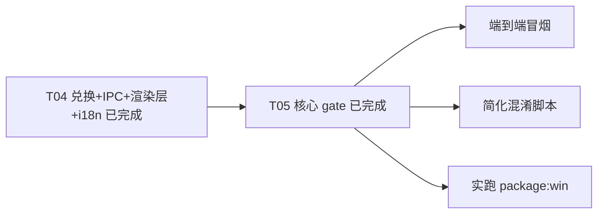

# plan-2.1 · 离线授权体系收尾结转（来源 plan-2.0 T05）

## 背景（承接说明，非归档）

`plan-2.0` 的 **T04（兑换 + IPC + 渲染层 + i18n）** 与 **T05 核心（feature-gate / 云同步 IPC 首行 gate / service 层兜底 gate / 云同步 UI 锁态 / 9 语种 i18n 校验）** 已全部完成，且已通过：

- `pnpm typecheck`（`tsconfig.main.json` + `tsconfig.json`）：exit 0，无错误；
- `_validate_locale.cjs`（9 语种）：`missingKeys=0` / `placeholderMismatch=0`；
- 删除陈旧的 `src/preload/index.d.ts`（与 `src/preload/index.ts` / `src/renderer/src/lib/electron.ts` 双源重复且大幅漂移，无任何代码 import，删除后 typecheck 仍 exit 0）。

本 plan **仅承接 plan-2.0 T05 中尚未落地的 3 项**，避免随 plan 删除而丢失。

## 范围与边界（已固化，不再展开）

离线授权体系主体已落地：`src/main/license/`（facade + 机器码 + vault + verifier + trial + feature-gate + redeem + config + keys + constants + types + errors + assets）、`src/shared/activation-types.ts`、`src/shared/license-constants.ts`、`src/main/activation-store.ts` 瘦身、`src/main/index.ts` 新 IPC 与 gate、`src/main/cloud-sync-service.ts` service 层兜底 gate、`src/renderer/.../{activationStore,ActivationModal,ActivationBadge,CloudSyncManager}`、`src/renderer/src/locales/*.json` 的 `license.*` 段。

## TODOS（结转自 plan-2.0 T05，来源版本标注）

> 规则：完成即从本列表删除，不留 `[x]`；本目录同时只保留一个活动 plan。

- [ ] **端到端冒烟**（来源 plan-2.0 T05）：用测试 Ed25519 私钥签 token → 兑换/导入 → 云同步解锁；换机器码 → 拒绝；改签名 → 统一文案 `license.errors.generic`；`killSwitch:true` → 全放行。依赖后端/测试私钥，占位值在 `src/main/license/assets/license.config.json`（redeem 域名、exp 单位、`.lic` 格式、是否回传 serverTime 待后端确认）。
- [ ] **简化 `scripts/obfuscate-main.mjs`**（来源 plan-1.0 / plan-2.0 T05）：去掉 `.pnpm` 通配兜底分支 + 更新注释。纯清理、零行为变化，待主进程混淆链路空闲时处理。
- [ ] **实跑 `pnpm run package:win`**（来源 plan-1.0 / plan-2.0 T05）：验证 NSIS 安装包 + portable 产物 + 混淆后主进程正常启动 + `resources/license/` 资产正确落盘（公钥/配置双源）。需在本机（GUI 环境）执行，CI/沙箱无 GUI 无法验证启动。

## 任务依赖

